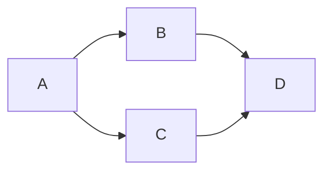
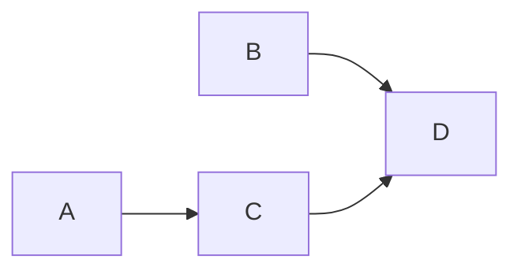

# ML Synthesis Schema

## Purpose

Explains how multiple existing concepts interact, compose, or justify each
other in a specific paper's context. Produced when the user asks "why do X
and Y work together," "what does X buy you given Y," or similar relational
questions.

## Conventions

- **Prerequisite**: all referenced concepts must already have single-concept
  explanation files. If any do not, Explainer subagent creates those first, then
  writes the synthesis file.
- **All symbols and notation** must be consistent with the concept files being
  synthesized.
- **Length target**: 1-2 pages.
- **File placement**: `vault_path(slug, "<filename>")` (resolved via `tools/paths.py`), where `<slug>` is the paper in whose context this synthesis was first requested and `<filename>` follows the Synthesis filename rule below.
- **Bidirectional cross-referencing**: Synthesis files do not trigger bidirectional cross-referencing. The synthesis file links to its component concept files (in Sections 2 and 7), but Explainer subagent does not modify those component files to add back-links to the synthesis.
- **Synthesis filename**: `synth__<concept_a>__<concept_b>.md`, where `<concept_a>` and `<concept_b>` are the existing filenames of the component concept files (without the `.md` extension), alphabetized. Example: for the synthesis of `graph-mutilation.md` and `causal-markov-condition.md`, the filename is `synth__causal-markov-condition__graph-mutilation.md.` Extend to N components as `synth__a__b__c.md`
- **Audience, notation, diagram** rules and LaTeX conventions follow those of `.cursor/skills/ml-explanation/SKILL.md`. n particular: `$ ... $` for inline math, `$$ ... $$` for display math; never `\( ... \)` or `\[ ... \]`.

## Required sections

### 0. Heading

Every `synth__<concept_a>__<concept_b>.md` must begin with:

```markdown
---
category: model
tags:
- AI-guided-paper-reading
- paper-concept-explanation
---

# <concept_a> and <concept_b> in <slug>
<!-- Capitalize the each word in <concept_a> and <concept b> -->

**Paper context**:  one-sentence summary of what the paper does
```

### 1. Question

The relational question this file answers. One sentence.

for example: Why do mutilation and Markov factorization work together to produce a more efficient inference algorithm?

### 2. Components

Bullet list linking to each concept file involved, with a one-sentence
reminder of what each concept is. The reader should not need to leave
this file to follow the synthesis.

for example:

- [graph-mutilation.md](graph-mutilation.md): Removes edges whose target
  is in the intervention set $U'$, producing a modified graph $G^{U'}$
  where those nodes become roots.
- [causal-markov-condition.md](causal-markov-condition.md): Asserts that
  every node is conditionally independent of its non-descendants given
  its parents, licensing a per-node factorization of the joint.

### 3. Role of each component

For each concept, one paragraph: what does it contribute to the combined
mechanism? What would be missing without it?

for example:

- **Graph mutilation** changes *which* conditionals appear in the
  factorization by reshaping each node's parent set in $G^{U'}$.
  Without mutilation, every factor in the product would be an
  *observational* conditional — $P(B \mid A)$ rather than the
  intervention indicator $\mathbb{1}[B = x_B^t]$. The Markov
  condition cannot distinguish observing from setting; mutilation is
  what makes the factorization describe an intervention.

- **The causal Markov condition** delivers the factorization itself.
  Given a graph (mutilated or not), it asserts that the joint
  decomposes into a product of per-node conditionals on parent sets.
  Without it, mutilation would give us a modified graph but no
  graph-structured expression for the joint — we would still face an
  intractable $n$-dimensional distribution.

### 4. Composition

The core of the document. How do the components interact? Derive the
combined result. If the composition produces a formula, show it with
equation numbers from the paper.

for example:

Let $G = (\mathcal{V}, \mathcal{E})$ be a DAG and let $U' \subseteq \mathcal{V}$
be a candidate intervention set. Without the Markov condition, the
interventional joint $P^{G}(\mathbf{V} \mid \text{do}(U'))$ has no
graph-structured factorization — we would have to manipulate a full
$n$-dimensional joint, which is intractable.

Mutilation and the Markov condition compose in two steps:

**Step 1 — Mutilation reshapes the parent structure.** Define the mutilated
graph $G^{U'} = (\mathcal{V}, \mathcal{E}^{U'})$ by removing all edges
incoming to nodes in $U'$. In $G^{U'}$, nodes in $U'$ have empty parent
sets; all other parent sets are unchanged.

**Step 2 — The Markov condition factorizes over the new parent sets.**
Applying the causal Markov condition to $G^{U'}$ yields:

$$P^{G^{U'}}(\mathbf{V} = \mathbf{x}^t \mid \text{do}(U')) =
\prod_j P\!\left(v_j = x_j^t \mid \mathbf{Pa}_{v_j}^{G^{U'}}\right).
\tag{Eq. 3}$$

The composition is exact, not approximate: mutilation changes which
parent sets appear in the product; the Markov condition guarantees the
product equals the joint. Neither step on its own gives a tractable
interventional factorization — it is their composition that does.

### 5. Why this combination
What problem does the combination solve that neither component alone
could? What alternatives were considered or rejected (if the paper
discusses them)?

for example:

The combination solves a problem neither concept addresses alone.
Mutilation on its own produces $G^{U'}$ — a correctly-structured
interventional graph — but gives no prescription for computing the
distribution over it. The Markov condition on its own factorizes a
joint distribution into per-node conditionals, but applied to the
original graph $G$ it produces the observational factorization
$P(A)\cdot P(B \mid A) \cdot P(C \mid A) \cdot P(D \mid B, C)$, which
wrongly treats intervention as conditioning.

Together they produce Eq. 3: a factorization whose structure is
interventionally correct (because it runs on $G^{U'}$) and
computationally tractable (because it is a product of small local
conditionals). PDGrapher exploits this by running its GNN on
$G^{U'}$ — message passing approximates each local factor
$P(v_j = x_j^t \mid \mathbf{Pa}_{v_j}^{G^{U'}})$, and the product
objective is what the cross-entropy loss implicitly maximizes.

The paper does not discuss rejected alternatives in detail, but
classical alternatives include variational inference on the full
joint (requires a tractable approximating family, which is hard to
design over $\{0,1\}^n$) and MCMC sampling (computationally
prohibitive for $n \sim 10^4$ genes).

### 6. Worked example
A concrete instance showing all components acting together on the same
small system (3-5 items).

for example:

Consider a 4-gene DAG with nodes $\{A, B, C, D\}$ and edges
$A \to B$, $A \to C$, $B \to D$, $C \to D$.

**Original graph $G$:**



Parent sets in $G$:

| Node | $\mathbf{Pa}_{v_j}$ in $G$ |
|------|----------------------------|
| $A$  | $\emptyset$ |
| $B$  | $\{A\}$     |
| $C$  | $\{A\}$     |
| $D$  | $\{B, C\}$  |

**Step 1 — Markov factorization on $G$ alone (observational).**

Applying the causal Markov condition to $G$ gives the observational joint:

$$P(A, B, C, D) = P(A) \cdot P(B \mid A) \cdot P(C \mid A) \cdot P(D \mid B, C).$$

Now suppose we want the *interventional* distribution under
$\text{do}(B = x_B^t)$. The Markov condition alone does not help here —
it does not distinguish $P(B \mid A)$ (conditioning) from a forced
assignment (intervening). Without mutilation we cannot express the
interventional joint in factorized form.

**Step 2 — Apply mutilation for $U' = \{B\}$.**

Mutilation removes all edges incoming to $B$. The edge $A \to B$ is
deleted; everything else is preserved.

**Mutilated graph $G^{U'}$:**



Updated parent sets in $G^{U'}$:

| Node | $\mathbf{Pa}_{v_j}^{G^{U'}}$ | Change? |
|------|------------------------------|---------|
| $A$  | $\emptyset$                  | no      |
| $B$  | $\emptyset$                  | **yes** (was $\{A\}$, now empty) |
| $C$  | $\{A\}$                      | no      |
| $D$  | $\{B, C\}$                   | no      |

**Step 3 — Apply the Markov condition to the *mutilated* graph.**

The Markov condition now factorizes the interventional joint over the
new parent sets:

$$P^{G^{U'}}(A, B, C, D \mid \text{do}(B = x_B^t))
= P(A) \cdot \mathbb{1}[B = x_B^t] \cdot P(C \mid A) \cdot P(D \mid B, C).
\tag{Eq. 3}$$

Compare factor-by-factor:

| Factor in $G$ | Factor in $G^{U'}$ | Source of change |
|---|---|---|
| $P(A)$ | $P(A)$ | unchanged — $A$'s parents didn't change |
| $P(B \mid A)$ | $\mathbb{1}[B = x_B^t]$ | **mutilation** removed $A \to B$, making $B$ parentless; the intervention fixes its value |
| $P(C \mid A)$ | $P(C \mid A)$ | unchanged — $C$'s parents didn't change |
| $P(D \mid B, C)$ | $P(D \mid B, C)$ | unchanged — $D$'s parents didn't change; $B$'s new (intervened) value propagates through this factor |

**The composition in action:**

Exactly one factor in the product changes, and it changes in exactly the
right way: the gene whose edges were mutilated is the gene whose factor
becomes the intervention indicator. Every other factor carries forward
unchanged, so the intervention's downstream effects propagate naturally
through the preserved edges.

Neither concept alone produces this cleanly. Mutilation without the
Markov condition gives you a modified graph but no factorized joint.
The Markov condition without mutilation gives you the wrong
factorization — $P(B \mid A)$, which models observation, not
intervention. Together they give Eq. 3: an interventional joint that is
both correct (thanks to mutilation) and tractable (thanks to the
Markov factorization).

### 7. Cross-references
Links to the component concept files (which should already link back,
via bidirectional-linking rule) and relevant spec.md sections.

for example:

**Component concepts:**
- [graph-mutilation.md](graph-mutilation.md)
- [causal-markov-condition.md](causal-markov-condition.md)

**Sections of spec.md:**
- [spec.md §3 — Problem setup / objective](spec.md#3-problem-setup--objective) — where Eq. 2, Eq. 3, and Eq. 5 are stated
- [spec.md §4 — Assumptions](spec.md#4-assumptions) — A2 and A4, the assumptions this synthesis relies on

**External references:**
- Pearl (2009), *Causality: Models, Reasoning, and Inference*, Cambridge University Press — Chapter 3 (do-calculus and the mutilated graph)