# PaperLab visualizer dictionary

A controlled vocabulary of visual idioms for drawing ML paper concepts.
The visualizer consults this dictionary when transforming text concepts into
pictures, so the same actor (e.g., a vector, a sampling step, a hop pool)
gets a consistent visual treatment across pictures and across papers.

---

## How to use this dictionary

1. **Read the text** describing the concept to visualize.
2. **For each named thing** in the text, find its row in **Entities** — that
   row tells you what visual shape to draw.
3. **For each structural arrangement** between things (membership, conditional
   dependence, sequence, decomposition, …), find its row in **Relations** —
   that row tells you how to connect the shapes.
4. **For each verb** the text uses (sample, encode, pool, attend, bound, …),
   find its row in **Actions** — that row tells you what visual idiom carries
   the action.
5. **If a concept doesn't fit any entry**, apply the **gap rule** (below)
   rather than silently inventing a one-off symbol.

### Conventions

Some constructs do not get their own dictionary entries because the visual
language for them is universal in technical writing:

- **Quantity comparisons and math operators** (`=`, `≤`, `≥`, `<`, `>`, `≈`,
  `∑`, `∫`, `∏`) are written as the math symbol on the picture. Do not
  invent a visual idiom for them.
- **Probabilistic and statistical qualifiers** (`Pr(·) ≥ 1−δ`, `E[·] = ·`,
  `Var[·]`) are written as math expressions inline. Do not invent a visual
  idiom for them.

### Backend conventions

- **Font.** Backends that render Unicode math labels (graphviz, tldraw) must
  use a font that covers Greek (`α β γ δ ε θ μ π σ τ φ ψ`), capital Greek
  (`Σ Φ Ψ Ω`), sub/superscripts (`zₜ`, `Z⁽ˡ⁾`), and special glyphs (`❄ ≤ ≥
  ∇ ∑ ∫ ∂ ∞`). Recommended: **Segoe UI** on Windows, **DejaVu Sans** on
  Linux/macOS. Specify both as a font fallback list (`"Segoe UI,DejaVu
  Sans,sans-serif"`) so the same source renders correctly on both.
- **Math notation in labels.** When the backend supports LaTeX (matplotlib
  mathtext, TikZ), use `$...$` inline math. When it does not (Mermaid,
  graphviz, tldraw), use Unicode math characters per `AGENTS.md`.

### The gap rule

When the text describes a concept that doesn't appear in the dictionary,
follow this cascade — do not invent a new visual idiom silently:

1. **Try composition first.** Express the concept as a composition of
   existing entities + relations + actions. Example: "spanning tree" =
   graph node (E13) + edge subset (E14) restricted to a tree topology;
   "unnormalized density $f$" = a function box (similar to critic E19)
   that takes a configuration in and emits a scalar (E2).
2. **If composition fails, use the closest entry plus a label.** Draw the
   structurally nearest entity and label it with the paper-specific name.
   Do not invent a new visual shape.
3. **Fallback for non-symbolizable verbs.** Generic verbs whose visual
   idiom is determined only by their object (e.g., "compute variance",
   "evaluate accuracy", "summarize results") are drawn as a **text-arrow**:

   ```
   — [verb objective] →
   ```

   For example: `— [compute σ²] → ` from a sample cluster to a scalar.
   The verb and object are spelled out on the arrow itself; the symbolic
   load is carried by the text, not by a visual glyph.
4. **If all of (1), (2), (3) still leave the concept unexpressed**, stop
   and report the gap. Do not draw the picture half-correctly.

### Drawing discipline — one action, one arrow

Each action entry (A1, A5, A7, …) is **one arrow** in the rendered picture,
not a multi-step chain. Sub-operations that exist only to feed the action
belong **inside the action's glyph** or **as an annotation on the action's
single arrow**, not as separate arrows.

Concretely:

- **A7 aggregate** is one arrow from the inputs into the $\Sigma$ glyph.
  If each contributor is preprocessed by a transform (e.g. $\tau(\cdot)W$),
  the transform is written as an annotation on the same A7 arrow — not as a
  separate A6 step. The action is one verb; the picture is one arrow.
- **A5 reparameterize** is one arrow from $(\mu, \sigma)$ into the sample
  output. The noise variable $\epsilon$ feeds the *same* arrow's head from
  the side; it is not a separate step.
- **A23 split** is the *identity* of the target chip (a vector chip with a
  visible mid-cut), not an arrow into a separate shape.
- **A1 sample** is one arrow from a distribution shape to a sample marker;
  the dice glyph (if used) rides on the arrow's midpoint, not as a shape.

Why: a picture with $N$ action verbs in its text should have $N$ action
arrows, not $2N$ or $3N$. Sub-step shapes inflate the picture, fragment the
reader's eye, and hide which verb each arrow corresponds to.

When in doubt: if removing a sub-step shape would still let the picture
read the same prose, the sub-step does not deserve its own shape. ("Shape"
here means a dictionary-typed picture element; "node" in PaperLab always
refers to a graph vertex from the paper.)

### Reading the columns

- **Canonical name** — the dictionary's internal name. Stable across edits.
- **Aliases** — surface forms that *trigger* the entry. The visualizer scans
  the text for these phrases (or math patterns) to decide which entry applies.
  Synonyms with the same underlying meaning are merged into this column.
- **Symbolic representation** — the visual idiom. Concrete enough to draw
  from, brief enough to fit in a table cell. Two visualizers reading the
  same row should draw recognizably similar things.

### Boundaries

- **Entity** = an *atomic* thing that has shape and can't be broken down into
  smaller entities. KL divergence and mutual information are *not* entities —
  they are operations performed on distributions, so they live under Actions.
- **Relation** = a *structural* fact about how entities sit relative to each
  other (membership, conditional dependence, decomposition, …). The *act* of
  establishing a relation is an Action, not a Relation.
- **Action** = a *verb* the algorithm performs. Canonical names are
  **verbs only** (no nouns) — a verb + adverb that specifies direction
  (e.g., "roll forward") is allowed and counts as a verb. The dictionary
  intentionally keeps actions generic; paper-specific names (e.g., "imagine"
  in Dreamer, "dream" in WorldModel) are listed as aliases of the generic
  action they instantiate (e.g., "roll forward").

Together these three categories form a small **grammar**: a sentence is
*subject (entity) — verb (action) — connective (relation) — object (entity)*.
A picture is the visual rendering of one or more such sentences.

---

## Schema (v0.1)

The dictionary is a flat list of entries within three categories. The entry
shape is:

```
| # | Canonical name | Aliases | Symbolic representation |
```

No nesting, no per-category extra fields, no provenance for now. Future
revisions can extend the schema (composition rules, do-not-use-for cross-
references, primitives per backend) if the simple shape proves insufficient.

---

## Entities (atomic)

| # | Canonical name | Aliases | Symbolic representation |
|---|---|---|---|
| E1 | vector | latent code, embedding, hidden state, representation $z, h, s, Z_X$ | a vertical column of small cells (cell-column chip); cell count $\sim$ dimensionality 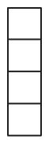 |
| E2 | scalar | reward, probability, log-likelihood, weight $\rho$, threshold, hyperparameter | a small filled disc, or a number printed inline; size $\sim$ magnitude when meaningful |
| E3 | tensor / image | observation $o_t$, frame $x_t$, RGB image | a square or rectangle with optional grid; for images, a thumbnail; spatial axes preserved 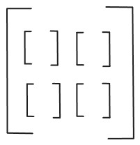|
| E4 | distribution | prior $p(z)$, posterior $p(z\mid x)$, likelihood $p(x\mid z)$, proposal $q(x)$, marginal $p(y)$ | a smooth density curve (continuous) or a histogram / bar set (discrete); the *shape* of the curve carries the distribution's character 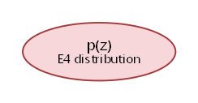 |
| E5 | conditional distribution | $p_\theta(s_t\mid\ldots)$, $q_\phi(z\mid x)$, $p(z_{t+1}\mid a_t, z_t, h_t)$ | a distribution shape (as E4) sitting inside a thicker-bordered enclosure, with incoming arrows from the conditioning variables 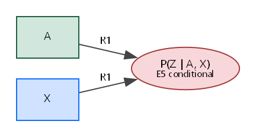 |
| E6 | sufficient statistics (μ, σ) | encoder outputs, Gaussian parameters $(\mu, \sigma^2)$ | a vector chip (as E1) split into two named halves; top half labeled $\mu$, bottom half labeled $\sigma$ or $\sigma^2$ 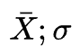 |
| E7 | parameter set | $\theta, \phi, \psi, \rho$ (learnable) | a small square with a hat or color code; attached to the function it parameterizes via a thin line (not an arrow) 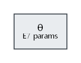|
| E8 | dataset | $\mathcal D$, $\mathcal X = \{x^{(i)}\}$, rollout buffer | a stack of cards or a labeled bin; size indicates "large collection" |
| E9 | minibatch | $X_M$, $B$ sequences, $K$-sample batch | a small cluster of sample markers, drawn from the dataset bin via a sampling arrow 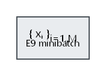 |
| E10 | sample (a single realization) | $x^{(i)}$, $\epsilon^{(l)}$, $z^{(i,l)}$, $x_i \sim q$ | a single marker — a dot, a tagged cell, or a highlighted dot 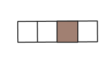 |
| E11 | trajectory / sequence | $\{(s_\tau, a_\tau)\}_{\tau=t}^{t+H}$, $\{x_t\}_{t=1}^L$, time series | a horizontal chain of entities (one per step) connected by next-step arrows |
| E12 | loop index / operational substrate | layer $l$, time $t$, hop $t$, epoch, generation, IS sample $i$ | a labeled frame (rectangle or band) enclosing the per-iteration content, with the loop name written on the frame |
| E13 | graph node | $v$, $u$, vertex | a filled circle, optionally with a name inside 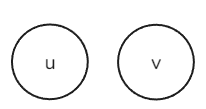 |
| E14 | graph edge / adjacency | $A$, $E$, edge $(u,v)$ | a line connecting two nodes; arrow if directed 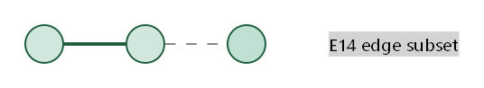 |
| E15 | candidate set / neighborhood | hop pool $V_{vt}$, k-NN candidates, leave-one-out negatives | a dashed ring (or enclosure) around an anchor entity, containing the candidate nodes on its boundary 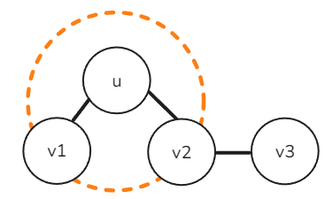 |
| E16 | learnable weight matrix | $W^{(l)}, W_c, W_{\mathrm{out}}, W_2 W_1$ | a small grid (rows × cols); attached to a function as its parameter (see E7) 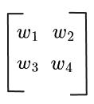 |
| E17 | nonlinearity | $\tanh, \mathrm{ReLU}, \mathrm{LeakyReLU}, \sigma$ | a small operator glyph, e.g., a "kink" curve for ReLU or "S" for sigmoid; placed inline on an arrow 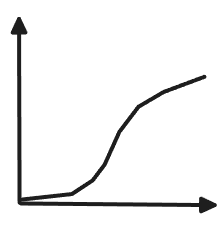 |
| E18 | noise variable | $\epsilon \sim \mathcal N(0, I)$, Gumbel noise | a small jittered marker or a stylized "$\epsilon$" disc; usually injected into a reparameterization step 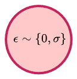 |
| E19 | critic / energy function | $f(x, y)$ | a labeled black-box rectangle that takes two inputs and emits a scalar 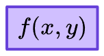 |
| E20 | recurrent state | $h_t$ (LSTM hidden), $c_t$ (LSTM cell) | a vector chip (as E1) with a self-loop arrow back to itself (the recurrence) |
| E21 | reference distribution | $p_\theta(z) = \mathcal N(0, I)$, $Q(Z_A)$ uniform / Bern$(\alpha)$, $q(y)$ as variational marginal | same shape as a distribution (E4), rendered in grey or with a "ghost" outline; signals "this is what we're comparing to" |
| E22 | controller / policy | $q_\phi(a \mid s)$, $a = W_c[z; h]$, $\pi$ | a labeled trapezoid or rectangle taking state in, emitting action out |
| E23 | terminal event / done flag | $d_t$, episode end, $\mathit{done}_t$ | a small "stop" glyph (filled square or X) attached at the time-step where termination is decided  |

---

## Relations (structural)

| # | Canonical name | Aliases | Symbolic representation |
|---|---|---|---|
| R1 | conditional dependence | "$A \mid B$", "given $B$", $p(A \mid B)$ | directed arrow from the condition $B$ into the outcome $A$ |
| R2 | temporal next-step | $A_t \to A_{t+1}$, "next step", "evolves to" | horizontal arrow from $A_t$ to $A_{t+1}$, optionally annotated with the transition operator |
| R3 | parameterized-by | $f_\theta$, $p_\theta$, $W_c$ | parameter symbol attached to the function via a thin line (not an arrow); the function and parameter sit close together |
| R4 | membership | $u \in S$, $x_i \in X_M$, $T \in \mathcal T$ | the member sits on (or inside) the boundary of the containing enclosure |
| R5 | expectation scope | $\mathbb{E}_{p(x)}[\cdot]$, "average under $p$" | a containing brace or shaded background labeled with the distribution; the averaged expression sits inside |
| R6 | bound / ordering | $A \leq B$, "upper-bounds", "lower-bounds", "tightens to" | write the math symbol (`≤`, `≥`, `=`, `≈`) directly; no further visual idiom needed (see Conventions) 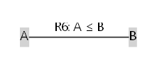 |
| R7 | decomposition | $A = B_1 + B_2 + \ldots$, "$A$ splits into" | a large brace or parenthesis labeled $A$ on the outside, containing $B_1, B_2, \ldots$ inside; each part labeled 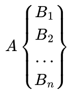 |
| R8 | stop-gradient barrier | $\mathrm{sg}(\cdot)$, "frozen during", "target network" | a perpendicular bar across an arrow (like a one-way valve); gradient cannot flow back through it |
| R9 | transfer / reuse | "trained in $E_1$, deployed in $E_2$", "policy transfer" | the same module drawn once with two arrows pointing into two different context boxes 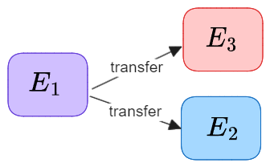 |
| R10 | hop / graph distance | $d(u, v) = t$ | concentric rings around an anchor node, one ring per hop $t$; candidate nodes sit on the ring matching their hop 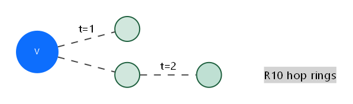 |
| R11 | i.i.d. | "i.i.d.", "$x_i \sim p$ independently" | multiple sample markers drawn identically, with a small "i.i.d." badge or repeated arrows from the same distribution 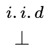 |
| R12 | composition (chained modules) | $f = f_2 \circ f_1$, "V $\to$ M $\to$ C", "encoder $\to$ sample $\to$ decoder" | modules drawn as boxes in a horizontal or vertical chain, connected by single arrows; the chain itself is the relation 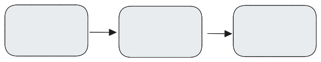 |

---

## Actions (verbs)

Actions split implicitly into **data-flow** (acts on data: sample, transform,
pool, …) and **meta** (acts on quantities or the gradient graph: bound,
freeze, propagate, …). The split is reflected in the symbolic representation
but not as a separate column.

Canonical names are **verbs only** — no noun objects in the name (those go in
the symbolic representation or in a per-use label). A verb + adverb that
specifies direction (e.g., "roll forward") counts as a verb.

| # | Canonical name | Aliases | Symbolic representation |
|---|---|---|---|
| A1 | sample | "$\sim$", samples, draws, drawn iid from | arrow from a distribution shape (E4) to a sample marker (E10); optionally with a small die or dice glyph at the action point 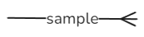 |
| A2 | draw | "draw from", "sample $n$ from", "drawn iid from" | arrow from a dataset bin (E8) or proposal (E4) to a minibatch cluster (E9); the cluster is the action's output 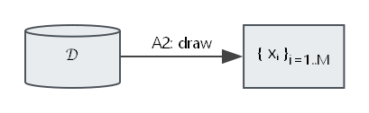 |
| A3 | encode | "embed", "recognize" | arrow from a data entity (E3) into a labeled encoder module, emerging as a latent vector (E1) 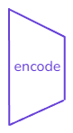 |
| A4 | decode | "reconstruct", "generate" | arrow from a latent vector (E1) into a labeled decoder module, emerging as a data entity (E3) 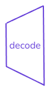 |
| A5 | reparameterize | "Gumbel-softmax", "reparameterization trick" | one arrow from sufficient statistics (E6) into the sample (E10); the noise variable (E18) feeds the *same* arrow's head from the side (must be drawn adjacent to A5's head, not floated far away). The sample is differentiable along the $(\mu, \sigma)$ path 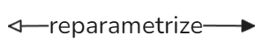 |
| A6 | transform | "project", "linear-map", "apply $W$" | arrow from input vector through a labeled box (the weight matrix E16) to output vector 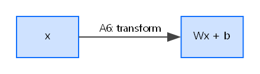 |
| A7 | aggregate | "pool", "sum-pool", "sum over", "mean", "mixture sum" | multiple arrows converging into a single $\Sigma$ glyph (or similar aggregator), with one outgoing arrow to the aggregated result. Specializations: partition function $Z = \sum_x f(x)$ is "aggregate over all configurations of $x$" |
| A8 | attend | "softmax over", "score each $u$", "attention" | rays from a query entity to each member of a candidate set (E15), with ray width or brightness proportional to the attention weight; emits a distribution (E4) over the set 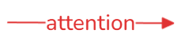 |
| A9 | predict | "infer", "classify", "output" | arrow from a vector through a labeled prediction head into a labeled output (class label, scalar, etc.) 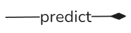 |
| A10 | iterate | "loop", "for", "while" | a labeled frame around the per-iteration content (uses E12 loop-index entity); the loop variable named on the frame |
| A11 | roll forward | "imagine", "dream", "rollout", "sample sequentially", "unroll" | a chain of repeated single-step samples (A1) drawn end-to-end as a horizontal sequence of arrows, each step's output feeding the next step's input |
| A12 | compare | "KL", "divergence from", "distance from" | two distribution shapes (E4 and E21) side by side, with a labeled gap or double-arrow between them; the gap *is* the comparison's magnitude 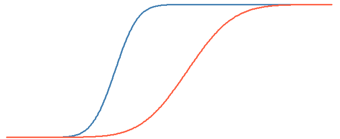 |
| A13 | measure | "mutual information", "$I(X;Y)$" — object is "dependency" | two random variables with a labeled overlap glyph (info-diagram lens) or a directed double-arrow labeled $I$; sometimes drawn as a Venn-style intersection |
| A14 | bound | "upper-bounds", "lower-bounds", "prove $A \leq B$" | the bounded quantity drawn with a horizontal line above (upper) or below (lower) it; relation written with the math symbol `≤` / `≥` (see Conventions) |
| A15 | sandwich | "$\hat Z^- \leq Z \leq \hat Z^+$", "combine upper and lower" | the target quantity drawn between two horizontal lines (upper bound above, lower bound below); the vertical interval is the sandwich |
| A16 | tighten | "tightens as $n \to \infty$", "any-time refinement" | a bound line (from A14) moving closer to the bounded quantity over an arrow labeled with the iteration / sample count |
| A17 | optimize | "maximize", "minimize", $\max_\phi$, $\min_\psi$, SGD, Adam, CMA-ES | a labeled $\max$ or $\min$ glyph attached to the objective; arrow indicating direction of improvement (up for max, down for min) |
| A18 | update | "gradient step", "Adam tick", "$\theta \leftarrow \theta + \eta g$" | an arrow from the gradient into the parameter (E7), often labeled with the optimizer step rule |
| A19 | propagate | "backprop through", "analytic gradients through" — object is "gradients" | a dashed reverse arrow drawn alongside the forward dataflow, going right-to-left (or backward along the chain) |
| A20 | freeze | "frozen during", "held fixed" | a snowflake or padlock glyph attached to the parameter (E7); during the freeze, no gradient arrow reaches it |
| A21 | compose | "$f_2 \circ f_1$", "chain", "stack layers" | the chained modules drawn as boxes connected by single arrows; the composition arises visually from the chain |
| A22 | concatenate | "stack", "$[z; h]$", "$\oplus$" | two vector chips (E1) drawn end-to-end, with a small bracket or "$;$" between them; the joined chip is the output |
| A23 | split | "first / second half", "partition into" | one vector chip (E1) with a visible mid-cut; the two halves labeled separately (e.g., as $\mu$ and $\sigma$) |
| A24 | squash | $\tanh$, sigmoid, "bound to range" | a small "S"-curve glyph inline on the arrow; the output range labeled |
| A25 | execute | "act in env", "$\mathrm{env.step}$" | arrow from action (E22 output) into an "env" box; environment returns observation and reward on the outgoing arrow |
| A26 | accumulate | "$\sum_t r_t$", "running sum", "fitness = mean return" | scalar samples flowing into a $\Sigma$ glyph along a sequence (E11); emits a single aggregated scalar |
| A27 | bootstrap | "$n$-step bootstrap", "value tail" | a partial rollout (chain of arrows) terminated by a labeled value glyph $v(\cdot)$; the value glyph supplies the "tail" |
| A28 | interpolate | "blend", "mix between" | two endpoint shapes drawn with a parameter-controlled axis between them; intermediate shapes shown along the axis |
| A29 | construct | "form", "build" — object is a distribution or proposal | inputs (components, scores) flowing into a labeled "construct" glyph, producing a distribution shape (E4) |
| A30 | estimate | "MC mean", "sample mean", "$\hat Z = \frac{1}{n}\sum w_i$" | $n$ sample markers flowing into a $\frac{1}{n}\Sigma$ glyph, emitting a single estimated scalar |
| A31 | evaluate | "analytic", "closed-form" — object is a deterministic function value | inputs flowing into a labeled compute-box (no random nodes inside), emitting the exact scalar |
| A32 | threshold | "kept if", "Bern keep/drop", "done > 0.5" | a horizontal cutoff line on a scalar axis; outcomes above and below labeled (kept / dropped, true / false) |
| A33 | constrain | "subject to", "$\sum w = 1$", "$\mathrm{TC} \leq \delta$" | a lock or clip glyph applied to the constrained quantity, with the constraint formula written adjacent in math (see Conventions) |
| A34 | regularize | "penalize", "$+ \beta \cdot \mathrm{KL}$" | an additive term drawn next to the main objective with a coefficient ($\beta$) glyph; the penalty's source (a comparison or distance) shown attached |
| A35 | perturb | "add noise", "exploration noise" | a small jitter glyph injected onto an arrow; the noise distribution labeled at the injection point |
| A36 | approximate | "$q \approx p$", "variational approximation" | the approximating distribution drawn solid; the target drawn ghostly behind it; an "$\approx$" glyph between them |
| A37 | divide | "ratio", "$w = f/q$", "density ratio" | two scalars (E2) feeding into a fraction bar (numerator over denominator), emitting a scalar |

---

## Long-tail entries (parked, not yet canonized)

The following appeared in only one paper in the seed corpus and have been
deferred. They may be promoted to the main tables when they recur in a
second paper.

- **Imagine** (Dreamer-specific) — alias of A11 (roll forward).
- **Dream** (WorldModel-specific) — alias of A11 (roll forward).
- **Value function** (Dreamer; RL-specific) — could be its own entity; for
  now treated as a parameterized scalar function (E2 + E7).
- **Mixture component** / **mixture weight** as separate entities — for now
  folded into A7 (pool / aggregate) and A29 (construct).
- **Eliminate variables** (GraphVarBound WMB) — A10 (iterate) over an
  elimination order + A7 (aggregate, marginalizing one variable per step).
- **Concentrate (Bernstein)** (GraphVarBound) — specific instance of A16
  (tighten).

---

## Open questions for future revisions

These were raised during the seed extraction and are deferred to v0.2:

1. **Composition / conflicts between entries** — when two entries co-occur in
   one picture, do they stack cleanly or compete? Not yet recorded.
2. **Per-backend primitives** — the symbolic representations are backend-
   agnostic. A future table can record which idioms are easy in matplotlib,
   which need TikZ, which need Graphviz.
3. **Patterns** — frequently co-occurring entity + relation + action triples
   (e.g., "anchor + candidate set + attend over set") could be promoted to
   named patterns. Not yet introduced; the current schema composes them on
   the fly.
4. **Provenance** — each entry currently lists no source. If we want to
   audit which paper an entry was extracted from, add a provenance column or
   side-file later.
