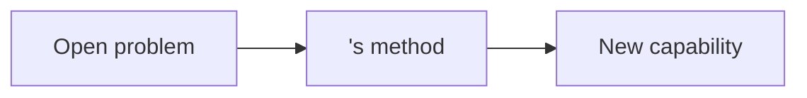
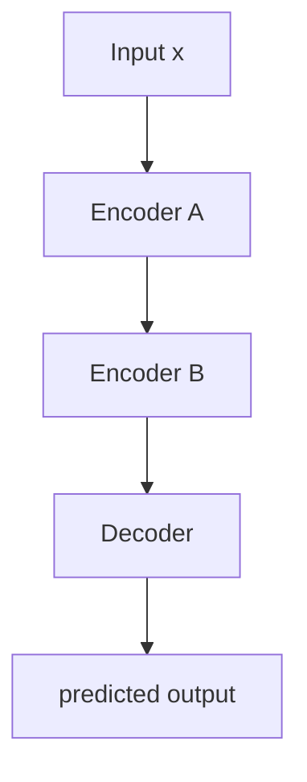
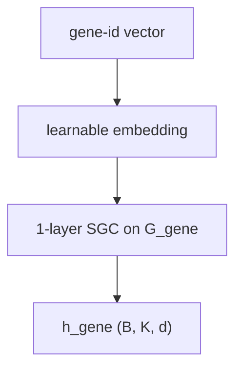

# ML Visualization Schema

## Purpose

This file defines the schema for visual artifacts produced by the Visualizer subagent: a full slide-deck summary of a paper (`slides.md`), standalone per-concept visualizations (`<concept>__viz.md`), and standalone per-concept PNG pictures (`figures/<concept>.png`). The point is **visual instruction**, not decoration: every diagram is paired with the prose and the equation it makes concrete.

The Visualizer never modifies `spec.md`, `code_map.md`, or `<concept>.md`. It produces its own files and cross-links into the others.

## Concept-picture workflow (dictionary-driven)

When the Visualizer is asked to draw **one picture for one concept** (as opposed to a full slide deck), it follows this fixed cascade:

1. **Read the source text.** Context-dependent: `<vault>/<slug>/<concept>.md` (from the `explainer`) when asked for a specific concept; a passage from `<vault>/<slug>/spec.md` (e.g., a pseudocode block from §6) when asked for a workflow or algorithm picture. Read all of it, including any worked example — the text is the picture's source material, not a prompt to be vaguely paraphrased.
2. **State the thesis.** One sentence: what is the picture *for*? The thesis is the unifying claim the picture argues, expressed in the paper's own vocabulary. Do not skip this; everything below references it. Test: a reader who walks away with only the picture and the thesis should be able to restate the claim.
3. **Inventory against `DICTIONARY.md`.** For each *named thing in the text*, find its dictionary entry. Build a table with three columns: *concept in the text → dictionary entry (E/R/A id) → notes*. **The inventory is driven by the text, not by the dictionary.** Walk the source text top to bottom; for each noun, verb, or relation that appears, look up its dictionary entry. Never reverse the direction (do not scan the dictionary asking "could I use this entry here?" — that produces clip-art, not pictures).
4. **Apply the gap rule** for any concept that doesn't fit an entry. The cascade is in `DICTIONARY.md` under "The gap rule"; in order: (1) compose from primitives, (2) draw the closest entry with a label, (3) text-arrow fallback `— [verb objective] →`, (4) stop and report. Never invent a new symbol silently.
5. **Honor the atomicity rule.** Each dictionary action (A1, A5, A7, …) is **one arrow** in the rendered picture. Sub-operations that exist only to feed the action belong as annotations on the action's arrow, not as separate arrows or nodes. See `DICTIONARY.md` → "Drawing discipline — one action, one arrow".
6. **Emit the picture spec** as a structured intermediate: a list of nodes (with dictionary tag and the role-specific label that goes inside the node) + a list of edges (with dictionary tag + label) + optional clusters for loop frames. The spec is what the renderer consumes; it is also the audit trail for steps 2–5.
7. **Render the picture spec** to a backend. Choose per the format selection table below. Default for concept-picture mode is **graphviz**.
8. **Verify against the thesis.** Re-read step 2. If the picture doesn't argue the thesis sentence, the spec is wrong; do not paper over with backend tweaks. Common spec errors caught here:
   - The thesis claims a *layered cascade* but the spec collapsed two stages into one node.
   - The thesis claims a *factorization* but the spec drew it as a single arrow.
   - The thesis describes *what changes per iteration* but the spec drew only one iteration with no loop frame.
9. **Hand off to the `figure-verifier` agent.** The verifier reads the source text and the rendered PNG independently (it does NOT trust the visualizer's spec or the visualizer's self-verification in step 8). It reports pass/fail per layer (lint, checklist, vision) to the console. On any fail, the visualizer revises the spec and re-renders; bounded retries (3 attempts), then escalate to the user. See `.cursor/skills/ml-figure-verify/SKILL.md` for the verifier's contract.

### What the dictionary is (and what it is not)

**The dictionary is a style guide, not a clip-art library.** Each entry tells the agent *how to draw an instance of that concept in this project's visual language* — a vector chip is a small box with these proportions and these colors; a conditional distribution is an ellipse with incoming conditioning arrows; a frozen parameter is a dashed box with a snowflake glyph. The entry does **not** supply a finished picture-tile to paste into concept pictures.

Concretely, when the renderer encounters a node tagged `E1 vector` with label `Z_X^(l-1)`:

- ✅ **Correct:** the renderer draws a vector-shaped node — small box, the project's vector-color palette — sized to the picture's scale, with `Z_X^(l-1)` as the node's label *inside* the shape.
- ❌ **Wrong:** the renderer pastes `symbols/E1.png` (the dictionary's *example* drawing of E1) into the concept picture as the node body, with `Z_X^(l-1)` as caption text below it. This produces a Frankenstein collage where every node is at a different scale, in a different drawing style, and the labels float untethered.

The user-drawn `symbols/<id>.png` files (and the auto-rendered `symbols/auto/<id>.png` fallbacks) are the *visual definitions* of the dictionary atoms. They live inside `DICTIONARY.pdf` as the reference card. **They are not assets the concept-picture renderer pastes into its output.** A concept picture redraws each atom inline, in the picture's own visual scale, integrating the role-specific label into the shape.

Mental model: the dictionary is to a concept picture what a typography style guide is to a printed page. The style guide says "headings are 14pt Helvetica bold, dark blue" — it does *not* supply pre-rendered PNG screenshots of every heading you might want to set. The page setter reads the style guide and types the actual heading at the right place on the page, in the right font.

### Why the dictionary at all

A controlled vocabulary keeps the same visual idiom (a vector chip, a Σ aggregator, a reparameterize-style arrow, a snowflake on a frozen parameter) across pictures and across papers. Without it, every concept invites the agent to reinvent the wheel, and the reader has to relearn the visual language for every figure. `DICTIONARY.md` is the source of truth for the *style*; SKILL.md routes around it.

### Canvas aspect ratio

Concept pictures are rendered on a **4:3 canvas envelope** (landscape, 9.6 × 7.2 inches at 160 DPI). This is the fixed slide-friendly target — wider aspect ratios encourage agents to lay everything out left-to-right in a single chain and lose the vertical structure (loop frames, side-incoming reparameterise arrows, parameter annotations). 4:3 forces the spec to use the vertical dimension productively. The renderer enforces this via graphviz `size="9.6,7.2!"`.

The 4:3 envelope is the **outer canvas**, not the main graph's bounding box. Inside that envelope, the canvas is split into a main-graph region (left) and a legend region (right) — see "Canvas layout" below.

### Dictionary-tag discipline — legend, not inline tags

Each node carries **only** its role-specific label (e.g., `Z_X^(l-1)`, `P(Z_A^(l) | A, Z_X^(l-1))`, `θ ❄ (frozen)`). Edges carry their semantic label only (`condition`, `sample`, `param-by`). Dictionary tags (`E5`, `A7`, …) are **not** drawn next to the glyphs; the visual idiom (shape, colour, line style) is the tag.

Instead, every rendered concept picture carries a **legend panel** on the right edge of the canvas (see "Canvas layout" below). The legend lists each distinct dictionary entry that appears in the picture, alongside:

- a **miniature instance of the glyph** in the picture's own style (swatch for entities, coloured line for relations/actions), and
- the **canonical name from `DICTIONARY.md`, verbatim** — the wording in the dictionary's "Canonical name" column, exactly as written there (e.g., "vector", "conditional distribution", "graph edge / adjacency", "conditional dependence", "parameterized-by", "sample", "reparameterize"). The legend does **not** display the dictionary code (`E14`, `R1`, `A5`, …) — those codes are an internal implementation detail of the renderer and never appear in the rendered picture.

This makes the picture self-explanatory in the same way a map legend makes a map self-explanatory: the reader doesn't need to memorise the dictionary or cross-reference IDs.

Rationale: codes like `E5` are useful in the picture-spec YAML and in the renderer's style table because they're stable identifiers. But on a picture meant for a paper-reading audience, codes leak internal IDs and force the reader to look up what they mean. Using the canonical *name* keeps the controlled vocabulary discoverable while letting the picture itself read as a picture.

The renderer emits the legend automatically from the set of dictionary IDs referenced in the spec, pulling the canonical-name string from `DICTIONARY.md` — no extra authoring required.

### Canvas layout

The 4:3 canvas is partitioned into two side-by-side regions:

- **Left region (≈ 75% width):** the main concept picture, laid out left-to-right per the spec's `rankdir` (typically `LR`). All concept nodes, edges, clusters, and the title sit here.
- **Right region (≈ 25% width):** the **legend panel**, a single vertical column of legend rows pinned to the right edge of the canvas.

The two regions together fill the 4:3 envelope. The legend is constrained to the right edge by an invisible edge from a sink node in the main graph to the legend node, combined with `rank="sink"`; the renderer handles this automatically. The legend never sits above or below the main graph, and it never overlaps it.

If the spec genuinely doesn't fit (rare — usually means the spec is overgrown and wants splitting into two pictures), the agent escalates to the user rather than silently switching aspect ratios or shrinking the legend.

### Worked example of the workflow (for the agent to imitate)

Given concept text `<vault>/GIB/markov-representation.md` and the request "draw the per-layer relay cell":

1. **Read.** Whole file, especially §1 Definition, §4 Formal statement, §5 Worked example, and the Algorithm-1 mapping table.
2. **Thesis.** "Each GIB layer factorizes into two stages: first sample a structural latent over neighbors `Z_A^(l) ~ P(· | A, Z_X^(l-1))`, then a feature latent by aggregating over those sampled neighbors `Z_X^(l) ~ P(· | Z_X^(l-1), Z_A^(l))` — the layered factorization is what makes per-layer compression bounds tractable."
3. **Inventory** (from the text, in source order):
   - "graph $D = (A, X)$" → E14 (adjacency) + E1 (features)
   - "feature latent $Z_X^{(l)}$" → E1 vector
   - "structural latent $Z_A^{(l)}$" → E14 (edge subset, stochastic variant)
   - "conditional $P(Z_A^{(l)} \mid A, Z_X^{(l-1)})$" → E5 conditional distribution
   - "conditional $P(Z_X^{(l)} \mid Z_X^{(l-1)}, Z_A^{(l)})$" → E5 conditional distribution (**second instance — do not merge with the first**)
   - "sample" (appears twice: once per conditional) → A1 × 2
   - "parameters $\theta$, frozen" → E7 + A20
   - "for each layer $l = 1, \ldots, L$" → E12 / A10 loop frame around the whole cell
4. **Gap rule.** "Local-dependence assumption" is a *property* of the chain, not a drawable atom — note it as a labeled annotation on the layer frame (closest-entry-with-label), don't try to draw it.
5. **Atomicity.** Each A1 sample is one arrow. The transform $\tilde{Z}_X^{(l-1)} = \tau(\cdot)W^{(l)}$ inside the second conditional is a sub-operation that rides as an annotation on the conditioning arrow (`R1 via τ(·)W^(l)`), not as a separate node.
6. **Spec.** Node list (8 nodes: A, Z_X^(l-1), θ, P_ZA, Z_A^(l), P_ZX, Z_X^(l)), edge list (7 edges), one cluster declaring the L-layer loop frame.
7. **Render.** Graphviz.
8. **Verify (self).** Does the picture show *two* conditional distributions chained `Z_X^(l-1) → P(Z_A) → Z_A^(l) → P(Z_X) → Z_X^(l)`? If only one conditional is drawn, the spec collapsed the cascade and the thesis is unmet — fix the spec.
9. **Verify (figure-verifier).** Hand off; if the agent reports FAIL, revise.

## Conventions

- **Audience:** the user is a visual learner reading the paper to understand the algorithm and decide whether to apply it. Assume PhD-level math fluency but not familiarity with the paper's domain jargon.
- **Source of structure:** the slide deck's content and ordering are **derived from `spec.md`'s schema**, not invented. See §"Major-content derivation" below.
- **Path resolution:** every file path is constructed via `tools/paths.py`. The Visualizer never hard-codes paths.
- **Math notation:** use LaTeX between `$ ... $` (inline) and `$$ ... $$` (display). Never Unicode math. Never `\( ... \)` or `\[ ... \]`. Match the paper's notation.
- **Slug:** verbatim user input. Never normalize.

## Format selection

The Visualizer picks one diagram format per visual. In order, try the first that fits:

| Need | Format | Lives where |
|---|---|---|
| **Concept picture** (one PNG per concept, dictionary-driven, atomicity rule, auto-layout) | **graphviz → PNG + SVG** | `vault_path(slug, f"figures/{concept}.png")`, embedded via `` |
| Flow, block diagram, sequence, simple architecture (in a slide) | **Mermaid** | inline in markdown / slide |
| Math diagram, commutative diagram, precise geometry | **TikZ** | inline in markdown / slide (renders via Obsidian Marp TikZ Plus plugin) |
| Numerical plot, learned distribution, loss curve | **matplotlib → SVG** | `vault_path(slug, "<name>.svg")`, embedded via `` |
| Hand-drawn editable architectural sketch | **tldraw `.tldr`** | `vault_path(slug, "<name>.tldr")`, opens natively in Obsidian tldraw plugin |
| Slide container (deck mode only) | **Marp** with external `paperlab` theme (see Header below) | `vault_path(slug, "slides.md")` |

**Default for concept-picture mode = graphviz** (see the "Concept-picture workflow" section above). Graphviz handles auto-layout (no manual coordinates, no label collisions), emits PNG/SVG/.dot directly, and is the only backend the dictionary's symbol sheet is built against. Use Mermaid/TikZ inside slide decks; use graphviz for standalone concept pictures.

**Default for slide-deck mode = Mermaid or TikZ.** Any escalation to SVG or tldraw must be justified in the reporting-back step (e.g., "Used SVG because the loss landscape is a 3D surface that Mermaid can't represent").

### Graphviz authoring (concept-picture mode)

When the picture spec is rendered through graphviz:

- **Resolve the binary via `tools.paths.graphviz_dot()`** — returns the portable Windows binary (`tools/graphviz/Graphviz-*/bin/dot.exe`) if present, else falls back to system `dot` on PATH (Linux / macOS).
- **Font:** specify `fontname="Segoe UI,DejaVu Sans,sans-serif"` on the graph and on `node`/`edge` defaults. This covers Greek, sub/superscripts, and the snowflake glyph used by A20.
- **No LaTeX.** Use Unicode math characters (`Σ`, `μ`, `σ`, `θ`, `ε`, `zₜ`, `Z⁽ˡ⁾`, `≤`, `≥`, `∑`) per the Mermaid label rules below — graphviz has the same constraint. Compound math (fractions, expectations with subscripted distributions) goes in the prose around the picture, not in node labels.
- **One arrow per action.** Honor the atomicity rule from `DICTIONARY.md`. If you find yourself drawing two arrows for a single dictionary verb (e.g., a separate transform node feeding an aggregate node), collapse the transform into the aggregate arrow's label.
- **Output two formats per picture:** `<name>.png` (the deliverable) and `<name>.svg` (resolution-independent backup). The `.dot` source can also be written alongside if the picture is likely to be regenerated.

### Mermaid layout rules (prevent slide overflow)

Marp slides are wider than they are tall, but not infinitely wide. Mermaid diagrams that exceed slide width get cropped. Apply these rules:

- **Prefer `flowchart TB` (top-bottom) over `flowchart LR` (left-right)** when a diagram has more than 4 nodes in a chain. Vertical flows fit slides better.
- **Cap any one diagram at ~6 nodes.** If a component pipeline is longer, split it into two slides ("Encoding stage" / "Decoding stage") or hide intermediate detail behind a single "..." node with a follow-up slide.
- **Keep node labels short** — ideally one line, max ~24 characters. Move longer descriptions to the prose section below the diagram.
- **Avoid newlines inside node labels** (`\n` or literal line breaks) unless rendering has been verified — they often look broken in Marp.
- **For wide computation graphs** that genuinely need a left-to-right view, use a TikZ diagram (renders at a fixed scaled size via Marp TikZ Plus) instead of forcing Mermaid.

### Mermaid label rules — avoid parse errors and unrendered math

Mermaid renders node and edge labels as plain text/HTML, not LaTeX. The parser is also strict about reserved characters. Every label in a Mermaid block MUST follow these rules:

- **No LaTeX inside Mermaid.** `$z_t$`, `\frac{a}{b}`, `\mathbb{R}`, `\theta` render literally — Mermaid is not a math engine. Use the three escape hatches below, in order of preference.
- **Escape hatch 1 — Unicode math characters (carved out by AGENTS.md for Mermaid labels only).** For atomic symbols use the Unicode glyph directly:
  - Greek: `α β γ δ ε θ λ μ π σ τ φ ψ ω` and capital `Γ Δ Θ Λ Ξ Π Σ Φ Ψ Ω`.
  - Operators / sets: `∇ ∑ ∏ ∫ ∂ ∞ ± × ÷ ≤ ≥ ≠ ≈ ∈ ∉ ⊂ ⊆ ∪ ∩ ℝ ℕ ℤ ℚ ℂ`.
  - Sub/superscripts (cover most ML usage): subscripts `₀₁₂₃₄₅₆₇₈₉ ₐ ₑ ᵢ ⱼ ₖ ₗ ₘ ₙ ₒ ₚ ₛ ₜ ₓ`; superscripts `⁰¹²³⁴⁵⁶⁷⁸⁹ ⁿ ⁱ ʲ ᵏ ᵀ`.
  - Examples: `zₜ`, `z_{t+1}` → `zₜ₊₁`, `xᵢ`, `∇θ L`, `KL(q ‖ p)`, `μ ± σ`, `ℝⁿ`.
- **Escape hatch 2 — `(eq. N)` cross-reference.** When a label needs compound math Unicode can't carry (`\mathbb{E}_{q_\phi(z|x)}[\log p_\theta(x|z)]`, fractions, integrals with limits, matrix expressions, plate notation), put a short ASCII tag in the label and render the real math in the right-column prose or equation block:
  - Node label: `["ELBO (eq. 3)"]`. Right column: `$$\mathcal{L}(\phi,\theta) = \mathbb{E}_{q_\phi(z|x)}\!\left[\log p_\theta(x|z)\right] - D_{\mathrm{KL}}(q_\phi(z|x)\,\|\,p(z))$$ *(spec.md §6, Eq. 3)*`.
- **Escape hatch 3 — escalate to TikZ.** When the diagram *is* the math (commutative diagrams, plate notation drawn with shapes, equations laid out spatially, anything requiring `\mathbb`/`\mathcal`/`\mathfrak` inside multiple nodes), don't fight Mermaid — switch the slide's diagram source to a ```` ```tikz ```` block. See **TikZ author rules** below.
- **No curly braces `{}`** in node labels — Mermaid reserves `{...}` for the rhombus shape syntax. Rewrite or quote: `["z_{t+1} dist"]`.
- **No unquoted parentheses `(...)`** in labels. Quote: `Node["f(x) = 1"]`.
- **No unquoted `<`, `>`, `|`** in labels — these are edge syntax. Quote the label if needed.
- **Edge labels** (`A -- text --> B`) must NOT contain `--`, `>`, or `<`.
- **Quote any label** that contains math symbols, punctuation other than `_` and digits, or spaces with special chars: `Sample["~ N(μ, σ)"]`.
- **Keep labels ≤ 24 characters** where possible. Longer labels should be quoted and pushed to the prose.
- **No literal newlines or `\n`** inside node labels.
- **Balance brackets.** Every `[` has a matching `]`, every `(` a matching `)`, every `"` paired. Every `flowchart`/`graph` block has every arrow terminated.

### TikZ author rules — when to use, how to write

TikZ via the `marp-tikz-plus` plugin renders LaTeX natively inside node labels: `$\mathbb{E}$`, `$\mathcal{L}$`, `$p_\theta(x\mid z)$`, `\mathrm`, `\mathfrak`, fractions, sub/superscripts of arbitrary depth, plate notation, commutative diagrams. Use TikZ for any slide whose diagram source qualifies as **escape hatch 3** above.

**Trigger to use TikZ instead of Mermaid:**

- Two or more node labels need math beyond Unicode's reach (`\mathbb`, `\mathcal`, nested sub/superscripts, fractions, expectations with subscripted distributions).
- The diagram is canonically a commutative diagram, plate diagram, factor graph, or geometric figure.
- The paper's own figure uses LaTeX-style labels and we want our reconstruction to match.

If only one label needs heavy math, prefer Mermaid + `(eq. N)` cross-reference (escape hatch 2). TikZ has higher author cost.

**Block shape (verified against the [marp-tikz-plus engine](https://github.com/kevinyuan/marp-tikz-plus)):**

````markdown
```tikz
\usepackage{amsmath}
\usepackage{amssymb}
\usetikzlibrary{positioning, fit, backgrounds}
\begin{document}
\begin{tikzpicture}[scale=2,
  every node/.style={font=\small},
  latent/.style={circle, draw, minimum size=0.9cm}]
  \node[latent] (z) {$z$};
  \node[latent, below=1.1cm of z] (x) {$x$};
  \draw[->] (z) -- node[right] {$p_\theta(x\mid z)$} (x);
\end{tikzpicture}
\end{document}
```
````

**Hard rules — violations cause silent compilation failure:**

1. **Never include `\documentclass{...}`.** The engine is plain TeX with TikZ preloaded, not LaTeX.
2. **Never include `\usepackage{tikz}`.** TikZ is preloaded; re-loading triggers "Undefined control sequence" or "Unknown package."
3. **`\usepackage{...}` is only legal for these preloaded packages:** `amsmath`, `amssymb`, `amsfonts`, `array`, `tikz-cd`, `pgfplots`, `circuitikz`, `chemfig`, `tikz-3dplot`. Anything else fails. Use only what you need (most ML diagrams only need `amsmath` + `amssymb`).
4. **`\usetikzlibrary{...}` goes in the preamble** (before `\begin{document}`). Common libraries the agent will need:
   - `positioning` — `[right=of foo]`, `[below=1cm of bar]` syntax.
   - `fit`, `backgrounds` — bounding boxes around node sets (plate notation).
   - `arrows.meta` — modern arrow tips (`-Stealth`, `-Latex`).
   - `calc` — coordinate arithmetic `($(a)+(b)$)`.
   - `shapes.geometric` — `[diamond]`, `[ellipse]`, `[trapezium]`.
   - `matrix` — grid layouts.
   - `decorations.pathmorphing` — wavy / coiled arrows.
5. **`\begin{document}…\end{document}` is optional** (the plugin's preprocessor auto-wraps if missing), but include it explicitly for clarity.
6. **Always pass `[scale=2]`** (or larger) to `tikzpicture` for Marp slides. Marp renders at 1280×720; default TikZ scale looks tiny.
7. **Math inside node labels uses standard LaTeX** — `$\mathcal{L}$`, `$p_\theta(x|z)$`, `$\mathbb{R}^n$`. No `(eq. N)` cross-reference needed — it renders in the label directly. (The AGENTS.md "no Unicode math" rule applies in full inside TikZ — use `$\theta$`, not `θ`.)
8. **TikZ blocks render in Obsidian preview AND in Marp/PPTX export**, both via `marp-tikz-plus`. Rendered SVG is cached; reruns are instant.

### Pre-write Mermaid check (mandatory)

Before writing `slides.md`, the agent MUST walk through every Mermaid block in the deck and verify:

1. Every label complies with the **Mermaid label rules** above.
2. No LaTeX syntax (`$...$`, `\frac`, `_{...}`, `^{...}`, `\mathbb`, `\mathcal`, `\theta`, `\sum`, any `\`-prefixed math command) appears anywhere inside a ```` ```mermaid ```` block. If any does, rewrite the offending label using escape hatch 1 (Unicode), escape hatch 2 (`(eq. N)` cross-reference), or escalate the whole diagram to TikZ (escape hatch 3).
3. Brackets balance: count of `[`, `(`, `"` equals count of `]`, `)`, `"`.
4. Every edge has both endpoints (no `A -->` dangling).
5. The longest top-to-bottom node chain is ≤ 5 (with `split tall`) or ≤ 4 (with plain `split`). Diagrams with 6+ nodes in one chain MUST be split across two slides — not crammed in via `split tall`.

### Pre-write TikZ check (mandatory)

Before writing `slides.md`, the agent MUST walk through every ```` ```tikz ```` block and verify:

1. No `\documentclass{...}` line anywhere.
2. No `\usepackage{tikz}` line. (TikZ is preloaded.)
3. Every `\usepackage{...}` names a member of the allowed set: `amsmath`, `amssymb`, `amsfonts`, `array`, `tikz-cd`, `pgfplots`, `circuitikz`, `chemfig`, `tikz-3dplot`.
4. Every `\usetikzlibrary{...}` appears **before** `\begin{document}` (or before the implicit auto-wrap if `\begin{document}` is omitted).
5. The block contains exactly one `\begin{tikzpicture}` and one matching `\end{tikzpicture}`.
6. For Marp slides, `tikzpicture` carries `[scale=2]` (or larger) — otherwise the diagram will render too small on the 1280×720 canvas.
7. Brackets balance: every `{`, `[`, `(`, `$` has its match.

If any block fails any check, rewrite it until it passes.

### Pre-write equation check (mandatory)

Before writing `slides.md`, walk through every `$$ ... $$` block and verify:

1. No citation strings (e.g., `(spec.md §X)`, `\tag{...}`) appear inside the math block. Citations live on their own markdown line after the equation, in italics.
2. Long equations (~6+ multiplicative terms, or any equation with multi-line bounds) use `\begin{aligned} ... \end{aligned}` to break across lines.
3. **Equations are quoted verbatim from `spec.md`.** The Visualizer NEVER re-derives, simplifies, or "improves" an equation. If `spec.md` distinguishes a definition from a deployment form (per `ml-paper-spec` equation-fidelity rule), the deck must preserve that distinction — typically the definition goes on the architecture slide and the deployment form is mentioned as prose on the algorithm-walkthrough slide. If a `spec.md` equation looks wrong relative to the source PDF, do NOT silently fix it — surface a `⚠️ UNCERTAIN: spec.md §X equation may have merged implementation into definition — verify against paper` and proceed with the spec.md text as-is.

If any block fails any check, **rewrite that block** until it passes. Do not write a `slides.md` containing blocks the agent itself flagged as failing. The reporting-back step must explicitly confirm "all N Mermaid blocks passed the pre-write check."

We currently rely on this rules-based check; a real `mmdc` validator is deferred until needed.

### Content-slide layout — routed by figure source and aspect ratio

**Hard layout rule.** Every content slide MUST use one of three layout classes — `split`, `figure-top`, or `figure-full` — chosen by the table below. Single-column free-flow layouts are forbidden; the only unclassed slides are the title (`lead`) and the final references slide.

| Slide role | Figure source | Aspect (W/H) | Layout class | Rationale |
|---|---|---|---|---|
| **Headline (slide 2)** — any extracted PNG | Extracted PNG | < 2.5 | **`figure-top`** (forced) | Slide 2 is the one slide the reader must grok in 90 s. Half-column is never acceptable here, even for near-square figures. |
| Headline (slide 2) | Extracted PNG | ≥ 2.5 | **`figure-full`** (forced) | Panorama headline fills the slide. |
| Any other slide | Mermaid / TikZ | any | `split` | Diagram size is the agent's choice — force discipline. |
| Any other slide | Extracted PNG | < 1.4 (square / portrait) | `split` | Fits naturally in the left half-column. |
| Any other slide | Extracted PNG | 1.4 ≤ W/H < 2.5 (landscape) | **`figure-top`** | Half-column would shrink labels past legibility. |
| Any other slide | Extracted PNG | W/H ≥ 2.5, OR a result-table screenshot of any aspect | **`figure-full`** | Panorama / dense table — fills the slide; caption-only prose. |

**Decision rule the agent runs after `extract_figure` returns a path:**

```text
from PIL import Image
w, h = Image.open(path).size
ar = w / h

# Headline override — slide 2 is never half-column.
if slide_index == 2 and slide_source == "extracted":
    cls = "figure-full" if ar >= 2.5 else "figure-top"
elif slide_source in ("mermaid", "tikz"):
    cls = "split"
elif slide_is_result_table or ar >= 2.5:
    cls = "figure-full"
elif ar >= 1.4:
    cls = "figure-top"
else:
    cls = "split"
```

The agent MUST log each slide's chosen class and `(w, h, ar)` tuple in the report-back step so misroutes can be spotted at a glance.

#### `split` (two-column) — body contract

The body MUST contain, in order:

1. `<!-- _class: split -->` directive.
2. `## <heading>` — spans both columns.
3. **Exactly one** top-level block immediately after the heading — the figure/diagram. Pinned to the **left** column by the theme (`h2 + *` selector).
4. **One or more** further top-level blocks — prose paragraph, optional display equation, optional citation line. All stack vertically in the **right** column (`h2 + * ~ *` selector; auto-flow places row 2, row 3, ... in column 2). Typical right-column shape:

   ```markdown
   <prose paragraph, ≤ 3 sentences>

   $$<one display equation>$$

   (spec.md §X, Eq. N)
   ```

#### Tall-diagram modifier

If the slide's figure is a Mermaid (or TikZ) diagram with **≥ 5 nodes in a vertical chain** (a long `flowchart TB` pipeline), add the `tall` modifier:

```markdown
<!-- _class: split tall -->
```

This triggers a tighter height cap (320 px) plus a smaller node-label font (11 px) so the diagram shrinks more aggressively and never bleeds past the slide. For diagrams with < 5 nodes — or any horizontally laid-out diagram — use plain `<!-- _class: split -->` so the figure renders at its natural size without unnecessary shrinkage.

**Hard cap.** `split tall` is valid only for vertical chains of **5 nodes maximum**. For 6+ nodes in a single chain, do NOT extend `split tall` — split the diagram across two slides ("Encoding stage" / "Decoding stage"), or compress with a single `...` placeholder node and a follow-up slide. The 320 px cap is not enough for 6-node chains and they will clip at the slide bottom.

Rule of thumb (count nodes in the longest top-to-bottom chain of the diagram):

| Longest TB chain | Class | Action |
|---|---|---|
| ≤ 4 nodes | `split` | render at natural size |
| 5 nodes | `split tall` | force tight cap |
| ≥ 6 nodes | **forbidden** | split across two slides |
| Horizontal (LR) diagrams | `split` | render at natural size |

No single-column free-flow slides. The only unclassed slides are *structural*: the title (`lead`) and the final references slide.

#### `figure-top` — body contract

For landscape extracted figures (1.4 ≤ W/H < 2.5). The body MUST contain, in order:

1. `<!-- _class: figure-top -->` directive.
2. `## <heading>` — full width.
3. **Exactly one** image block — the extracted PNG; spans full slide width, capped at 480 px tall by the theme.
4. **One or more** further blocks — short prose strip below the figure.

Right-column cap does not apply (no right column). Use the `figure-top` cap below.

#### `figure-full` — body contract

For panorama figures (W/H ≥ 2.5) and result-table screenshots. The body MUST contain, in order:

1. `<!-- _class: figure-full -->` directive.
2. `## <heading>` — small, top-left.
3. **Exactly one** image block — fills the slide.
4. **At most one** caption line below — the §4.5 caption verbatim, in italic.

No prose paragraphs, no equations on `figure-full` slides. If the slide needs commentary, add a follow-up `split` slide titled "<headline> — interpretation".

#### Per-class content caps (hard caps; if exceeded, split into two slides)

| Class | Prose | Equations | Citation line |
|---|---|---|---|
| `split` | ≤ 3 sentences, ≤ 80 words | 1 display OR 2 inline | yes |
| `figure-top` | ≤ 2 sentences, ≤ 50 words | 1 inline only | yes |
| `figure-full` | caption verbatim only | none | none |

If the natural content for one slide overflows the cap, divide it into two slides instead — e.g., "MDN-RNN — architecture" + "MDN-RNN — loss". Do NOT shrink the font, do NOT extend content past the slide bounds. Splitting the slide is the only allowed remediation.

**Equation placement (hard rule).** Never place citation strings, `\tag{...}`, or any non-math text inside `$$ ... $$`. KaTeX parses everything inside as math and will both garble the citation and break line wrapping. Instead:

```markdown
$$ p(z_{t+1} \mid a_t, z_t, h_t) = \sum_{k=1}^K \pi_k \, \mathcal{N}(z_{t+1}; \mu_k, \mathrm{diag}(\sigma_k^2)) $$

*(spec.md §5–6)*
```

If a single display equation is wider than the half-column (typical breakpoint: more than ~6 multiplicative terms, or any equation with `\sum`, `\int`, `\prod` over multi-line bounds), break it across lines with `aligned`:

```markdown
$$
\begin{aligned}
p(z_{t+1} \mid a_t, z_t, h_t) &= \sum_{k=1}^K \pi_k \, \mathcal{N}\!\left(z_{t+1}; \mu_k, \mathrm{diag}(\sigma_k^2)\right) \\
\pi_k, \mu_k, \sigma_k &= \mathrm{MDN}_\phi(h_t)
\end{aligned}
$$
```

The theme has a safety net (`section.split .katex-display { overflow-x: auto }`) that surfaces a horizontal scrollbar when an equation still overflows — treat that as a signal to apply `aligned`, not to leave as-is.

**Forbidden:** `<div class="left">` / `<div class="right">` wrappers. They are unnecessary (the theme's `h2 + *` / `h2 + * + *` selectors pin columns automatically) and render as raw HTML in non-Marp previewers.

## Major-content derivation

The Visualizer does not invent the deck's structure. It derives it from the dissector's existing extraction:

1. **Read `vault_path(slug, "spec.md")`.** Mandatory.
2. **Read `vault_path(slug, "code_map.md")` if it exists.** Validates components and provides data-flow detail.
3. **Read `vault_path(slug, "<concept>__viz.md")` and concept files** for any concept the deck will reference — to avoid duplicating effort and to keep cross-links consistent.
4. **Read `spec.md` §4.5 Figures & Tables.** This drives the extract-first waterfall below. If §4.5 is absent (older spec.md predates this schema), surface "spec.md has no Figures section — re-run the dissector before generating the deck" and stop.
5. Map spec.md sections to deck slides as follows:

| spec.md section | Slide(s) |
|---|---|
| §1 Context + §2 Contribution | 1 title-area slide (text only) |
| §4.5 Figures — `headline` entry | 1 **headline-figure slide** (slide 2; see below) |
| §3 Problem setup | 1 slide (informal + formal) |
| §6 Algorithm — pseudo-code | 1 "overview" slide. **If a paper figure shows the architecture** (likely the same `headline` figure), reuse it here as a *zoom* with arrows highlighting the data flow. Generate a Mermaid block ONLY if no such figure exists. |
| §6.1 Detailed components | **One slide per component IF the component is visible in `headline` and warrants zooming.** Components with no figure and no pseudo-code worth visualizing are folded as bullets under the relevant flow — no slide. |
| §6 pseudo-code revisited | 1–2 walkthrough slides showing data flow step-by-step |
| §7 Hyperparameters | 1 slide *only if* a hyperparameter is conceptually load-bearing (e.g., the bottleneck dimension). Otherwise skip. |
| §4.5 — pick the `result` entry that best answers "did this method beat alternatives?" (usually a cross-method comparison table); fall back to §9 Results prose if no comparison `result` exists | 1 slide with the headline number or comparison |
| §10 Limitations | 1 slide |

Target total: **8–12 slides** for a typical paper. Compress or expand by adjusting §6.1 grouping. If §6 has fewer than 3 detailed components, the paper may not be worth a full deck — surface this to the user.

## Extract-first waterfall — the canonical figure rule

The Visualizer's most common failure mode is **mechanically generating one Mermaid diagram per spec.md component** while missing the single figure that captures the paper's whole idea. To prevent this, every figure-bearing slide follows this priority order:

**TikZ is the default for generated diagrams.** Mermaid is reserved for diagrams that are *purely* a linear/branched pipeline (sequence of boxes connected by arrows) — anything else (architecture, plate notation, math, comparisons, anatomical zooms) goes to TikZ. Rationale: TikZ renders LaTeX natively in labels, looks polished in slides and printed material, and is the user's explicit preference. Mermaid is kept only for the narrow case where it is *strictly faster to author* and the diagram has no math.

1. **If `spec.md` §4.5 has a relevant `headline` / `thumbnail` / `qualitative` / `baseline-comparison` entry** → call `tools.figures.extract_figure_to_vault(slug, "Figure", N)` (CLI: `python -m tools.figures extract-to-vault <slug> Figure <N>`), which copies the cached PNG into `<vault>/<slug>/figures/` and returns a **vault-relative** path (e.g. `figures/figure4.png`). Read the PNG's dimensions, pick the layout class per the routing table, and embed as ``. The §4.5 caption row becomes the slide's prose. **Never embed the absolute repo path**; the deck is rendered from the vault and absolute paths break cross-drive / OneDrive setups.
2. **If no relevant paper figure exists** → generate a **TikZ** block per the TikZ author rules above. This is now the default for *every* generated diagram — architecture, component zooms, plate notation, loss/objective diagrams, anything visual that isn't a strict pipeline. TikZ labels render `$\mathcal{L}$`, `$p_\theta(x\mid z)$`, `\mathbb{R}^n` natively.
3. **Mermaid is allowed only when** the diagram is a strict sequence/branched pipeline (e.g., `Input → Encoder → Latent → Decoder → Output`, a swimlane, a decision tree), labels need no math beyond Unicode atomics, and TikZ would be slower to author for no visual gain. If in doubt, prefer TikZ — the Mermaid carve-out is narrow.
4. **If neither figure nor pseudo-code exists** → drop the slide entirely. Diagrams-for-diagrams'-sake are forbidden.

The same waterfall applies per-slide:

| Slide type | P1 (extract) | P2 (TikZ — default) | P3 (Mermaid — pipelines only) | P4 (drop) |
|---|---|---|---|---|
| Headline figure (slide 2) | §4.5 `headline` | reconstruct as TikZ from §6 | — | flag deck unbuildable |
| Architecture overview | reuse headline | **TikZ** block diagram | — | — |
| Component zoom | §4.5 figure showing this component | **TikZ** with math-bearing labels | — | drop component |
| Loss / objective / generative-model diagram | §4.5 figure | **TikZ** (plate, expectation, KL) | — | flag |
| Algorithm walkthrough — strict pipeline | §4.5 sequence/swimlane figure | TikZ if labels need math | Mermaid TB pipeline (no math) | drop slide |
| Algorithm walkthrough — branching / state machine | §4.5 figure | **TikZ** | — | drop slide |
| Results | §4.5 `result` entry — pick the cross-method comparison table | render table as TikZ if reconstructing | — | — |
| Qualitative examples | §4.5 `qualitative` figure | — | — (cannot fake) | drop slide |

### Embedding an extracted figure

After `extract_figure_to_vault` returns the vault-relative path, **read the PNG's dimensions (from the cached file under `papers/<slug>/.cache/figures/`) and pick the layout class** per the routing table. The image block is always the first block after `## <heading>`, and the embed uses the **vault-relative** path.

**Square / portrait figure (W/H < 1.4) → `split`** — figure occupies the left column:

```markdown
<!-- _class: split -->

## V → M → C interaction (Figure 4)


The world model factors into three modules: ConvVAE (V) compresses each frame
to $z_t$, MDN-RNN (M) predicts $z_{t+1}$ conditioned on $a_t$, and the linear
controller (C) maps $[z_t\;h_t]$ to $a_t$. Training is staged: V then M then C.

*(spec.md §4.5 Figure 4)*
```

**Landscape figure (1.4 ≤ W/H < 2.5) → `figure-top`** — figure spans full slide width above a short prose strip:

```markdown
<!-- _class: figure-top -->

## Memento architecture (Figure 3)


Planner LLM and executor LLM share a parametric memory bank; the executor
retrieves the top-k past traces before each step.

*(spec.md §4.5 Figure 3)*
```

**Panorama / result-table (W/H ≥ 2.5, or any aspect for tables) → `figure-full`** — figure fills the slide; caption-only prose:

```markdown
<!-- _class: figure-full -->

## Performance comparison (Table 1)


*Performance comparison of prompt-based, training-based, and our approach on seven open-domain QA benchmarks. (spec.md §4.5 Table 1)*
```

Use the vault-relative path returned by `tools.figures.extract_figure_to_vault`. If labels are illegible at slide size, prefer `extract_figure_to_vault(..., dpi=200, refresh=True)` (higher DPI, same aspect ratio — class choice doesn't change) before falling back to Mermaid.

### When extraction tooling is unavailable

If `tools.figures` raises (e.g., `pymupdf` not installed), embed a placeholder slide and surface the gap rather than silently substituting Mermaid:

```markdown
<!-- _class: split -->

## Headline figure (Figure 4) — extraction pending

> ⚠️ pymupdf not installed. Run `pip install pymupdf` and re-run
> the visualizer to embed the paper's Figure 4 here.

The headline figure (caption: "Flow diagram of V → M → C interaction
during one timestep") shows the canonical world-models architecture...
```

## Required outputs

### Deck mode (`slides.md`)

A Marp markdown deck. Must be valid Marp (parses with `marp slides.md` and renders in the Obsidian Marp Slides plugin).

#### Header

Every `slides.md` must begin with this minimal Marp front-matter — no inline `style:` block:

```markdown
---
marp: true
theme: paperlab
paginate: true
math: katex
paper: <slug>
---
```

The `paper:` key is non-standard for Marp but ignored by the renderer; it lets Obsidian's Dataview / property search treat `slides.md` like every other PaperLab artifact (`spec.md`, `code_map.md`, ...) and group all files for one paper.

**Theme is always `paperlab`** for both deck mode and concept mode. The actual CSS lives outside the repo at `marp_theme_path` in `paperlab.config.yaml`; just emit `theme: paperlab` in front-matter and Marp resolves it. Never substitute `gaia`, `default`, or any other built-in Marp theme — those won't carry the `split` / `figure-top` / `figure-full` layout classes the schema relies on.

All presentation (font, padding, palette, page header/footer, `lead` / `invert` / `section` / `split` class variants, Mermaid sizing) is owned by the external `paperlab.css` theme. The visualizer never inlines CSS into `slides.md`.

The theme path is resolved per machine via `marp_theme_path` in `paperlab.config.yaml` (helper: `tools.paths.marp_theme_path()`). A repo-level `.marprc.yml` registers it for `marp` CLI users; VS Code / Obsidian users register the same path in their Marp plugin settings.

Then the title slide, then content slides separated by `---` on their own line.

#### Per-slide requirements

Every content slide MUST have either:

1. **A visual element** (Mermaid, TikZ, SVG embed, or tldraw embed), **OR**
2. Be a designated *structural slide* (title / references / limitations / pure-text closing). Structural slides do not need a visual.

For visual slides, the content order is:

1. **Slide title** (`## <heading>`).
2. **One diagram** — the visual carrying the structure.
3. **2–4 sentences** of prose explaining what the diagram shows, in the paper's own terminology. Tie diagram elements to spec.md notation. Make explicit what *changes* when key inputs or parameters vary.
4. **At most one cited equation**, anchoring the formalism. Cite as `(spec.md §X, Eq. N)`.

Walls of bullets are forbidden. Walls of pictures with no prose are forbidden. **The deck is instructional.**

#### Default slide skeleton (worked example)

```markdown
---
marp: true
theme: paperlab
paginate: true
math: katex
paper: <slug>
---

<!-- _class: lead -->

# <Paper title>

**Authors:** ...
**Venue:** ...

(File locations — PDF, `spec.md`, `code_map.md`, concept files — go in the final References slide, not here. Keep the title slide uncluttered.)

---

## Context & contribution



The paper attacks <problem> by introducing <method>, which enables
<outcome that earlier methods could not achieve>. The key idea is
<one-sentence intuition>.

> "<headline claim verbatim from §1>" — (spec.md §1)

---

## Problem setup

**Informal.** <one or two sentences>

**Formal.**

- *Input:* $\mathcal{D} = \{(x_i, y_i)\}_{i=1}^N$ where ...
- *Output:* $\hat{y}$ for a query ...
- *Evaluation:* ...

$$ \mathcal{L}(\theta) = \mathbb{E}_{(x,y) \sim \mathcal{D}}[\ell(f_\theta(x), y)] \tag{Eq. 1} $$

---

## Architecture overview



The model factors prediction into three stages: Encoder A extracts a
per-element representation, Encoder B integrates it with auxiliary
input, and the Decoder produces per-output predictions. Each block
has its own slide below.

(See spec.md §6 for the full pseudo-code.)

---

<!-- _class: split -->

## Encoder A — gene co-expression



Each cell's gene-id vector is embedded into a $d$-dimensional space, then a single SGC layer propagates information along the gene co-expression graph $\mathcal{G}_{\text{gene}}$. The output $h_{\text{gene}} \in \mathbb{R}^{B \times K \times d}$ feeds the perturbation-integration block.

$$ h_{\text{gene}} = \text{GNN}_{\theta_g}(x_{\text{gene}}, \mathcal{G}_{\text{gene}}) \tag{spec.md §6.1, Eq. 2} $$

---

(...repeat the split pattern for each major component...)
```

Notes on the split pattern above:

- The Mermaid fenced block is the **first** top-level block after `## <heading>` → the theme pins it to the left column.
- The prose paragraph + display equation together form the **second** top-level block (no blank line splits them into separate top-level blocks for Marp's purposes — they are sibling paragraphs inside the same column) → pinned to the right column.
- No `<div class="left">` / `<div class="right">` wrappers. Forbidden by the hard rule above.

Every `---` separator must be on its own line with blank lines around it (Marp requirement).

#### Required slides (in order)

1. **Title.** (`lead` class, text only.)
2. **Headline figure** — the paper's canonical architecture diagram, extracted via `tools.figures.extract_figure` using the `headline` entry from `spec.md` §4.5. **Mandatory.** This is the slide a reader spends 90 seconds on and walks away understanding the whole paper. If no `headline` figure exists in §4.5 (rare, paper has no architecture diagram), reconstruct from §6 pseudo-code as Mermaid and note the reconstruction in the right column.
3. **Context & contribution** — from spec.md §1 + §2. The visual can be a small Mermaid framing the open-problem → method → outcome arc, OR (preferred when available) the `thumbnail` figure from §4.5.
4. **Problem setup** — from spec.md §3.
5. **Architecture overview** — typically a zoom into the headline figure with arrows highlighting the training/inference pass, OR a Mermaid block diagram if no §4.5 figure decomposes the architecture.
6. **One slide per major component** — from spec.md §6.1. **Only components visible in the headline figure get their own slide.** Use a §4.5 component-specific figure if one exists; otherwise Mermaid from §6.1. Components with neither a figure nor pseudo-code worth visualizing are folded into bullets on a sibling slide.
7. **Algorithm walkthrough** — 1 or 2 slides showing data flow step-by-step. Prefer reusing the headline figure with elements highlighted across slides; Mermaid only if the paper has no sequence diagram.
8. **Objective / loss** — the central equation(s) with annotation. Equations quoted verbatim from spec.md (no re-derivation; see pre-write equation check #3).
9. **Results** — from spec.md §4.5 `result` entries (pick the one that best answers "did this method beat alternatives?" — typically a cross-method comparison table) or §9 prose. Compact: one headline metric, one comparison. The visualizer makes the "which result matters most" call at slide-generation time; the dissector does NOT rank results.
10. **Limitations** — from spec.md §10.
11. **References** — paper PDF (absolute path from `repo_pdf_path(slug)`), `spec.md`, `code_map.md`, any `<concept>.md` files, and the upstream repo URL. Structural slide; visual not required. **This is the only place file locations belong** — keep them off the title slide.

Label-consistency rule across slides 2, 5, 6, 7: per-component slides MUST reuse the same labels, abbreviations, and arrow conventions as the headline figure. If the headline calls it "V" don't switch to "ConvVAE" on the zoom; if the headline shows `z_t` don't switch to `z` on the loss slide.

### Concept mode (`<concept>__viz.md`)

Standalone visualization of a single algorithmic component or concept. Lives at `vault_path(slug, "<concept>__viz.md")`. The `<concept>` segment matches the filename of the corresponding `<concept>.md` (lowercase, hyphenated — *this is the explainer's filename convention, not a slug normalization*).

**Format:** Marp slide deck (3–6 slides), not a single long note. Concept mode and deck mode use the same Marp layout classes (`split`, `figure-top`, `figure-full`), the same per-class content caps, the same Mermaid/TikZ rules, and the same headline override (slide 2 of the concept deck is never `split`).

#### Schema

```markdown
---
paper: <slug>
category: concept
tags:
- AI-guided-paper-reading
- visualization
marp: true
theme: paperlab
paginate: true
---

<!-- _class: lead -->

# <concept>

<one-sentence paper context — same as in <concept>.md>

*See also: [<concept>.md](<concept>.md), [spec.md §<N>](spec.md#<anchor>)*

---

<!-- _class: figure-top -->

## The diagram

<TikZ block (default), OR extracted paper figure, OR Mermaid (pipelines only)>

<≤ 2 sentences naming each element of the diagram and tying it back to the
paper's notation.>

---

<!-- _class: split -->

## Key equation

<TikZ block, Mermaid block, OR a smaller annotated re-rendering of the diagram>

$$ ... $$

*(spec.md §X, Eq. N)*

---

<!-- _class: split -->

## What changes when …

<diagram OR equation>

<≤ 3 sentences describing the dynamic story — what varies when key
parameters or inputs change.>

---

<!-- _class: split -->

## Why this view (and what it omits)

<diagram OR comparison sketch>

<≤ 3 sentences. Why this is the right visualization; what an alternative
view (e.g., loss surface vs. computation graph) would expose or hide.>
```

#### Concept-mode rules

- **Always Marp.** `marp: true` in front-matter, every content slide uses one of the three layout classes. No single-page free-flow concept notes — that's what the explainer's `<concept>.md` is for.
- **Target 3–6 slides.** Title + diagram + equation are mandatory. "What changes when …" and "Why this view" are optional but recommended — drop only if the concept doesn't warrant them. Never cram all four sections into one slide.
- **Per-class caps apply** (≤ 3 sentences / ≤ 80 words for `split`, ≤ 2 sentences for `figure-top`, caption-only for `figure-full`). If the concept genuinely needs more prose, split into another slide — never extend past the cap, never shrink the font, never let content run off the bottom.
- **Headline override applies.** The first content slide (slide 2 of the concept deck, after the lead) is never `split` if the figure is extracted. Use `figure-top` or `figure-full` per the routing table.
- **Format priority is the same waterfall as deck mode:** extracted paper figure → TikZ (default) → Mermaid (pipelines only) → drop.
- One concept per file. Do not bundle.
- The file must cross-link to the existing `<concept>.md` (if it exists). If `<concept>.md` does not exist yet, suggest the user run the `explainer` first; do not invent its content.
- If `<concept>__viz.md` already exists, the regenerate-prompt rule applies (ask replace / append / abort).

## Scope boundaries

The Visualizer:

- Does not modify `spec.md`, `code_map.md`, or `<concept>.md`.
- Does not produce runnable code (that's the experimenter's territory).
- **Extracts figures from the PDF via `tools.figures.extract_figure`** (renders the page containing the figure as PNG, cached under `papers/<slug>/.cache/figures/`). Generated diagrams (Mermaid/TikZ/matplotlib/tldraw) are the *fallback* path per the extract-first waterfall above — they exist for cases where the paper has no usable figure for the slide.
- Does not invent paper content. If a slide would require asserting something not in `spec.md` or `code_map.md`, the slide is dropped or flagged with `⚠️ UNCERTAIN:`.

## Self-check

Before reporting back, verify:

- **Deck mode:**
  - File exists at `vault_path(slug, "slides.md")`.
  - Begins with the Marp directive header.
  - All 10 required slide types present (or, if some are skipped, the reason is stated in the reporting-back).
  - Every non-structural slide has a visual element.
  - No slide is bullets-only.
  - Total slides between 8 and 12 (or justify if outside that range).
  - All cited equations match `spec.md` notation.

- **Concept mode:**
  - File exists at `vault_path(slug, "<concept>__viz.md")`.
  - All four sections present (Diagram / What this shows / Key equation / Why this visualization).
  - Cross-links to `<concept>.md` and `spec.md` resolve.

## Reporting back

After writing, respond with:

- The path to the created file.
- A one-sentence summary of the chosen "story" (e.g., "deck centered on the V-M-C controller loop as the unifying abstraction").
- Format choices made and *why* — especially any escalation beyond Mermaid (SVG, tldraw, TikZ).
- Any `⚠️ UNCERTAIN:` flags raised.
- Any spec.md sections that were too thin to derive a slide from (suggest the user re-run the dissector if so).
