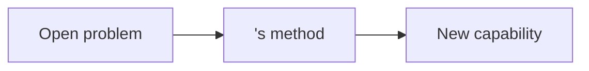
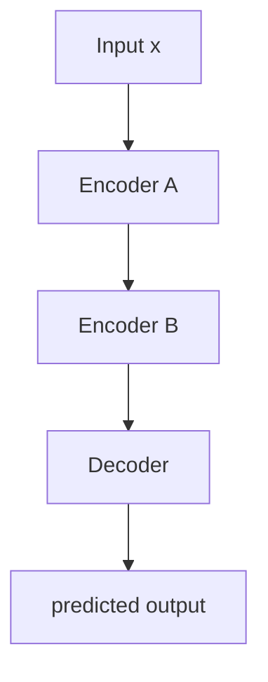
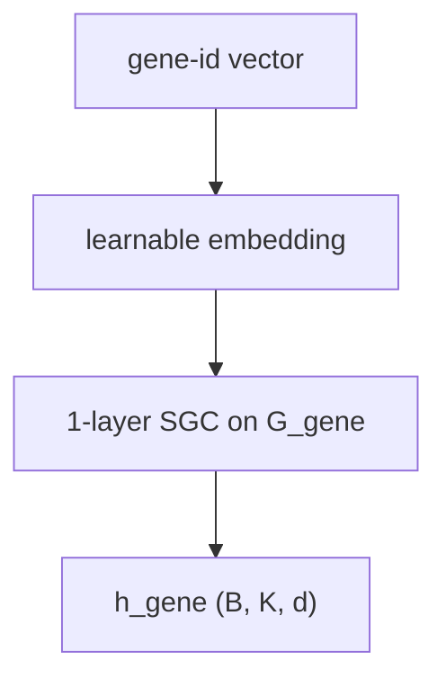

# ML Visualization Schema

## Purpose

This file defines the schema for visual artifacts produced by the Visualizer subagent: a full slide-deck summary of a paper (`slides.md`) and standalone per-concept visualizations (`<concept>__viz.md`). The point is **visual instruction**, not decoration: every diagram is paired with the prose and the equation it makes concrete.

The Visualizer never modifies `spec.md`, `code_map.md`, or `<concept>.md`. It produces its own files and cross-links into the others.

## Conventions

- **Audience:** the user is a visual learner reading the paper to understand the algorithm and decide whether to apply it. Assume PhD-level math fluency but not familiarity with the paper's domain jargon.
- **Source of structure:** the slide deck's content and ordering are **derived from `spec.md`'s schema**, not invented. See §"Major-content derivation" below.
- **Path resolution:** every file path is constructed via `tools/paths.py`. The Visualizer never hard-codes paths.
- **Math notation:** use LaTeX between `$ ... $` (inline) and `$$ ... $$` (display). Never Unicode math. Never `\( ... \)` or `\[ ... \]`. Match the paper's notation.
- **Slug:** verbatim user input. Never normalize.

## Format selection

The Visualizer picks one diagram format per visual. In order, try the first that fits:

| Need | Format | Lives where |
|---|---|---|
| Flow, block diagram, sequence, simple architecture | **Mermaid** | inline in markdown / slide |
| Math diagram, commutative diagram, precise geometry | **TikZ** | inline in markdown / slide (renders via Obsidian Marp TikZ Plus plugin) |
| Numerical plot, learned distribution, loss curve | **matplotlib → SVG** | `vault_path(slug, "<name>.svg")`, embedded via `` |
| Hand-drawn editable architectural sketch | **tldraw `.tldr`** | `vault_path(slug, "<name>.tldr")`, opens natively in Obsidian tldraw plugin |
| Slide container (deck mode only) | **Marp** with external `paperlab` theme (see Header below) | `vault_path(slug, "slides.md")` |

**Default = Mermaid or TikZ.** Any escalation to SVG or tldraw must be justified in the reporting-back step (e.g., "Used SVG because the loss landscape is a 3D surface that Mermaid can't represent").

### Mermaid layout rules (prevent slide overflow)

Marp slides are wider than they are tall, but not infinitely wide. Mermaid diagrams that exceed slide width get cropped. Apply these rules:

- **Prefer `flowchart TB` (top-bottom) over `flowchart LR` (left-right)** when a diagram has more than 4 nodes in a chain. Vertical flows fit slides better.
- **Cap any one diagram at ~6 nodes.** If a component pipeline is longer, split it into two slides ("Encoding stage" / "Decoding stage") or hide intermediate detail behind a single "..." node with a follow-up slide.
- **Keep node labels short** — ideally one line, max ~24 characters. Move longer descriptions to the prose section below the diagram.
- **Avoid newlines inside node labels** (`\n` or literal line breaks) unless rendering has been verified — they often look broken in Marp.
- **For wide computation graphs** that genuinely need a left-to-right view, use a TikZ diagram (renders at a fixed scaled size via Marp TikZ Plus) instead of forcing Mermaid.

### Mermaid label rules — avoid parse errors

Mermaid's parser is strict and silently fails when labels contain reserved characters. Every node label and edge label in a Mermaid block MUST follow these rules:

- **No LaTeX inside Mermaid.** `z_{t+1}`, `\frac{a}{b}`, `\mathbb{R}` and friends do NOT render — Mermaid is not a math engine. Use plain ASCII: `z_t+1`, `a/b`, `R`. Put real LaTeX in the prose column, not the diagram.
- **No curly braces `{}`** in node labels — Mermaid reserves `{...}` for the rhombus shape syntax. So `[z_{t+1} dist]` triggers a parse error. Rewrite as `[z next dist]` or quote the whole label: `["z_{t+1} dist"]`.
- **No unquoted parentheses `(...)`** in labels. If unavoidable, quote: `Node["f(x) = 1"]`.
- **No unquoted `<`, `>`, `|`** in labels — these are edge syntax. Quote the label if needed.
- **Edge labels** (`A -- text --> B`) must NOT contain `--`, `>`, or `<`.
- **Quote any label** that contains math symbols, punctuation other than `_` and digits, or spaces with special chars: `Sample["~ N(mu, sigma)"]`.
- **Keep labels ≤ 24 characters** where possible. Longer labels should be quoted and pushed to the prose anyway.
- **No literal newlines or `\n`** inside node labels.
- **Balance brackets.** Every `[` has a matching `]`, every `(` a matching `)`, every `"` paired. Every `flowchart`/`graph` block has every arrow terminated.

### Pre-write Mermaid check (mandatory)

Before writing `slides.md`, the agent MUST walk through every Mermaid block in the deck and verify:

1. Every label complies with the **Mermaid label rules** above.
2. No LaTeX syntax (`\frac`, `_{...}`, `^{...}`, `\mathbb{...}`, etc.) appears anywhere inside a ```` ```mermaid ```` block.
3. Brackets balance: count of `[`, `(`, `"` equals count of `]`, `)`, `"`.
4. Every edge has both endpoints (no `A -->` dangling).
5. The longest top-to-bottom node chain is ≤ 5 (with `split tall`) or ≤ 4 (with plain `split`). Diagrams with 6+ nodes in one chain MUST be split across two slides — not crammed in via `split tall`.

### Pre-write equation check (mandatory)

Before writing `slides.md`, walk through every `$$ ... $$` block and verify:

1. No citation strings (e.g., `(spec.md §X)`, `\tag{...}`) appear inside the math block. Citations live on their own markdown line after the equation, in italics.
2. Long equations (~6+ multiplicative terms, or any equation with multi-line bounds) use `\begin{aligned} ... \end{aligned}` to break across lines.

If any block fails any check, **rewrite that block** until it passes. Do not write a `slides.md` containing blocks the agent itself flagged as failing. The reporting-back step must explicitly confirm "all N Mermaid blocks passed the pre-write check."

We currently rely on this rules-based check; a real `mmdc` validator is deferred until needed.

### Two-column layout — the only allowed content layout

**Hard layout rule.** Every content slide MUST use `<!-- _class: split -->`. The body MUST contain, in order:

1. `<!-- _class: split -->` directive.
2. `## <heading>` — spans both columns.
3. **Exactly one** top-level block immediately after the heading — the figure/diagram. Pinned to the **left** column by the theme (`h2 + *` selector).
4. **One or more** further top-level blocks — prose paragraph, optional display equation, optional citation line. All stack vertically in the **right** column (`h2 + * ~ *` selector; auto-flow places row 2, row 3, ... in column 2). Typical right-column shape:

   ```markdown
   <prose paragraph, ≤ 3 sentences>

   $$<one display equation>$$

   (spec.md §X, Eq. N)
   ```

#### Tall-diagram modifier

If the slide's figure is a Mermaid (or TikZ) diagram with **≥ 5 nodes in a vertical chain** (a long `flowchart TB` pipeline), add the `tall` modifier:

```markdown
<!-- _class: split tall -->
```

This triggers a tighter height cap (320 px) plus a smaller node-label font (11 px) so the diagram shrinks more aggressively and never bleeds past the slide. For diagrams with < 5 nodes — or any horizontally laid-out diagram — use plain `<!-- _class: split -->` so the figure renders at its natural size without unnecessary shrinkage.

**Hard cap.** `split tall` is valid only for vertical chains of **5 nodes maximum**. For 6+ nodes in a single chain, do NOT extend `split tall` — split the diagram across two slides ("Encoding stage" / "Decoding stage"), or compress with a single `...` placeholder node and a follow-up slide. The 320 px cap is not enough for 6-node chains and they will clip at the slide bottom.

Rule of thumb (count nodes in the longest top-to-bottom chain of the diagram):

| Longest TB chain | Class | Action |
|---|---|---|
| ≤ 4 nodes | `split` | render at natural size |
| 5 nodes | `split tall` | force tight cap |
| ≥ 6 nodes | **forbidden** | split across two slides |
| Horizontal (LR) diagrams | `split` | render at natural size |

No single-column content slides. No exceptions. The only slides without `split` are *structural* slides: the title (`lead` class) and the final references slide (no class, pure text). Limitations should use `split` with a small Mermaid showing the limitation domain (e.g., "in-distribution" vs. "OOD") on the left.

**Right-column content cap** (hard cap; if exceeded, split into two slides):

- ≤ 3 sentences of prose (≤ 80 words total).
- At most 1 display equation, OR up to 2 inline equations.
- 1 short citation line (e.g., `(spec.md §6.1, Eq. 2)`).

If the natural content for one slide overflows the cap, divide it into two slides instead — e.g., "MDN-RNN — architecture" + "MDN-RNN — loss". Do NOT shrink the font, do NOT extend the right column off the slide. Splitting the slide is the only allowed remediation.

**Equation placement (hard rule).** Never place citation strings, `\tag{...}`, or any non-math text inside `$$ ... $$`. KaTeX parses everything inside as math and will both garble the citation and break line wrapping. Instead:

```markdown
$$ p(z_{t+1} \mid a_t, z_t, h_t) = \sum_{k=1}^K \pi_k \, \mathcal{N}(z_{t+1}; \mu_k, \mathrm{diag}(\sigma_k^2)) $$

*(spec.md §5–6)*
```

If a single display equation is wider than the half-column (typical breakpoint: more than ~6 multiplicative terms, or any equation with `\sum`, `\int`, `\prod` over multi-line bounds), break it across lines with `aligned`:

```markdown
$$
\begin{aligned}
p(z_{t+1} \mid a_t, z_t, h_t) &= \sum_{k=1}^K \pi_k \, \mathcal{N}\!\left(z_{t+1}; \mu_k, \mathrm{diag}(\sigma_k^2)\right) \\
\pi_k, \mu_k, \sigma_k &= \mathrm{MDN}_\phi(h_t)
\end{aligned}
$$
```

The theme has a safety net (`section.split .katex-display { overflow-x: auto }`) that surfaces a horizontal scrollbar when an equation still overflows — treat that as a signal to apply `aligned`, not to leave as-is.

**Forbidden:** `<div class="left">` / `<div class="right">` wrappers. They are unnecessary (the theme's `h2 + *` / `h2 + * + *` selectors pin columns automatically) and render as raw HTML in non-Marp previewers.

## Major-content derivation

The Visualizer does not invent the deck's structure. It derives it from the dissector's existing extraction:

1. **Read `vault_path(slug, "spec.md")`.** Mandatory.
2. **Read `vault_path(slug, "code_map.md")` if it exists.** Validates components and provides data-flow detail.
3. **Read `vault_path(slug, "<concept>__viz.md")` and concept files** for any concept the deck will reference — to avoid duplicating effort and to keep cross-links consistent.
4. Map spec.md sections to deck slides as follows:

| spec.md section | Slide(s) |
|---|---|
| §1 Context + §2 Contribution | 1 headline slide |
| §3 Problem setup | 1 slide (informal + formal) |
| §6 Algorithm — pseudo-code | 1 "overview" slide with a block diagram |
| §6.1 Detailed components | **One slide per component.** If more than 6 components, group conceptually related ones. |
| §6 pseudo-code revisited | 1–2 walkthrough slides showing data flow step-by-step |
| §7 Hyperparameters | 1 slide *only if* a hyperparameter is conceptually load-bearing (e.g., the bottleneck dimension). Otherwise skip. |
| §9 Results | 1 slide with the headline number or comparison |
| §10 Limitations | 1 slide |

Target total: **8–12 slides** for a typical paper. Compress or expand by adjusting §6.1 grouping. If §6 has fewer than 3 detailed components, the paper may not be worth a full deck — surface this to the user.

## Required outputs

### Deck mode (`slides.md`)

A Marp markdown deck. Must be valid Marp (parses with `marp slides.md` and renders in the Obsidian Marp Slides plugin).

#### Header

Every `slides.md` must begin with this minimal Marp front-matter — no inline `style:` block:

```markdown
---
marp: true
theme: paperlab
paginate: true
math: katex
---
```

All presentation (font, padding, palette, page header/footer, `lead` / `invert` / `section` / `split` class variants, Mermaid sizing) is owned by the external `paperlab.css` theme. The visualizer never inlines CSS into `slides.md`.

The theme path is resolved per machine via `marp_theme_path` in `paperlab.config.yaml` (helper: `tools.paths.marp_theme_path()`). A repo-level `.marprc.yml` registers it for `marp` CLI users; VS Code / Obsidian users register the same path in their Marp plugin settings.

Then the title slide, then content slides separated by `---` on their own line.

#### Per-slide requirements

Every content slide MUST have either:

1. **A visual element** (Mermaid, TikZ, SVG embed, or tldraw embed), **OR**
2. Be a designated *structural slide* (title / references / limitations / pure-text closing). Structural slides do not need a visual.

For visual slides, the content order is:

1. **Slide title** (`## <heading>`).
2. **One diagram** — the visual carrying the structure.
3. **2–4 sentences** of prose explaining what the diagram shows, in the paper's own terminology. Tie diagram elements to spec.md notation. Make explicit what *changes* when key inputs or parameters vary.
4. **At most one cited equation**, anchoring the formalism. Cite as `(spec.md §X, Eq. N)`.

Walls of bullets are forbidden. Walls of pictures with no prose are forbidden. **The deck is instructional.**

#### Default slide skeleton (worked example)

```markdown
---
marp: true
theme: paperlab
paginate: true
math: katex
---

<!-- _class: lead -->

# <Paper title>

**Authors:** ...
**Venue:** ...

(File locations — PDF, `spec.md`, `code_map.md`, concept files — go in the final References slide, not here. Keep the title slide uncluttered.)

---

## Context & contribution



The paper attacks <problem> by introducing <method>, which enables
<outcome that earlier methods could not achieve>. The key idea is
<one-sentence intuition>.

> "<headline claim verbatim from §1>" — (spec.md §1)

---

## Problem setup

**Informal.** <one or two sentences>

**Formal.**

- *Input:* $\mathcal{D} = \{(x_i, y_i)\}_{i=1}^N$ where ...
- *Output:* $\hat{y}$ for a query ...
- *Evaluation:* ...

$$ \mathcal{L}(\theta) = \mathbb{E}_{(x,y) \sim \mathcal{D}}[\ell(f_\theta(x), y)] \tag{Eq. 1} $$

---

## Architecture overview



The model factors prediction into three stages: Encoder A extracts a
per-element representation, Encoder B integrates it with auxiliary
input, and the Decoder produces per-output predictions. Each block
has its own slide below.

(See spec.md §6 for the full pseudo-code.)

---

<!-- _class: split -->

## Encoder A — gene co-expression



Each cell's gene-id vector is embedded into a $d$-dimensional space, then a single SGC layer propagates information along the gene co-expression graph $\mathcal{G}_{\text{gene}}$. The output $h_{\text{gene}} \in \mathbb{R}^{B \times K \times d}$ feeds the perturbation-integration block.

$$ h_{\text{gene}} = \text{GNN}_{\theta_g}(x_{\text{gene}}, \mathcal{G}_{\text{gene}}) \tag{spec.md §6.1, Eq. 2} $$

---

(...repeat the split pattern for each major component...)
```

Notes on the split pattern above:

- The Mermaid fenced block is the **first** top-level block after `## <heading>` → the theme pins it to the left column.
- The prose paragraph + display equation together form the **second** top-level block (no blank line splits them into separate top-level blocks for Marp's purposes — they are sibling paragraphs inside the same column) → pinned to the right column.
- No `<div class="left">` / `<div class="right">` wrappers. Forbidden by the hard rule above.

Every `---` separator must be on its own line with blank lines around it (Marp requirement).

#### Required slides (in order)

1. **Title.**
2. **Context & contribution** — from spec.md §1 + §2.
3. **Problem setup** — from spec.md §3.
4. **Architecture overview** — from spec.md §6 (pseudo-code summarized as a block diagram).
5. **One slide per major component** — from spec.md §6.1.
6. **Algorithm walkthrough** — 1 or 2 slides showing data flow step-by-step (use the same diagram pattern across slides, with elements highlighted as the data moves).
7. **Objective / loss** — the central equation(s) with annotation.
8. **Results** — from spec.md §9. Compact: one headline metric, one comparison.
9. **Limitations** — from spec.md §10.
10. **References** — paper PDF (absolute path from `repo_pdf_path(slug)`), `spec.md`, `code_map.md`, any `<concept>.md` files, and the upstream repo URL. Structural slide; visual not required. **This is the only place file locations belong** — keep them off the title slide.

### Concept mode (`<concept>__viz.md`)

Standalone visualization of a single algorithmic component or concept. Lives at `vault_path(slug, "<concept>__viz.md")`. The `<concept>` segment matches the filename of the corresponding `<concept>.md` (lowercase, hyphenated — *this is the explainer's filename convention, not a slug normalization*).

#### Schema

```markdown
---
category: model
tags:
- AI-guided-paper-reading
- visualization
---

# <concept> — visual

**Paper context:** one sentence (same as in `<concept>.md`).
**See also:** [<concept>.md](<concept>.md), [spec.md §<N>](spec.md#<anchor>)

## Diagram

<Mermaid block, OR TikZ block, OR , OR link to <name>.tldr>

## What this shows

2–4 sentences. Name each element of the diagram and tie it back to the
paper's notation. Make explicit what *changes* when key parameters or
inputs vary — what is the dynamic story the diagram tells?

## Key equation

$$ ... \tag{Eq. N} $$

One equation, cited with the paper's number if available.

## Why this visualization

1–2 sentences. Why is this the right view? What would a different
diagram type miss?
```

#### Concept-mode rules

- One concept per file. Do not bundle.
- The file must cross-link to the existing `<concept>.md` (if it exists). If `<concept>.md` does not exist yet, suggest the user run the `explainer` first; do not invent its content.
- If `<concept>__viz.md` already exists, the regenerate-prompt rule applies (ask replace / append / abort).

## Scope boundaries

The Visualizer:

- Does not modify `spec.md`, `code_map.md`, or `<concept>.md`.
- Does not produce runnable code (that's the experimenter's territory).
- Does not extract images from the PDF — it generates new diagrams in code (Mermaid/TikZ/matplotlib) or hand-drawable canvases (tldraw).
- Does not invent paper content. If a slide would require asserting something not in `spec.md` or `code_map.md`, the slide is dropped or flagged with `⚠️ UNCERTAIN:`.

## Self-check

Before reporting back, verify:

- **Deck mode:**
  - File exists at `vault_path(slug, "slides.md")`.
  - Begins with the Marp directive header.
  - All 10 required slide types present (or, if some are skipped, the reason is stated in the reporting-back).
  - Every non-structural slide has a visual element.
  - No slide is bullets-only.
  - Total slides between 8 and 12 (or justify if outside that range).
  - All cited equations match `spec.md` notation.

- **Concept mode:**
  - File exists at `vault_path(slug, "<concept>__viz.md")`.
  - All four sections present (Diagram / What this shows / Key equation / Why this visualization).
  - Cross-links to `<concept>.md` and `spec.md` resolve.

## Reporting back

After writing, respond with:

- The path to the created file.
- A one-sentence summary of the chosen "story" (e.g., "deck centered on the V-M-C controller loop as the unifying abstraction").
- Format choices made and *why* — especially any escalation beyond Mermaid (SVG, tldraw, TikZ).
- Any `⚠️ UNCERTAIN:` flags raised.
- Any spec.md sections that were too thin to derive a slide from (suggest the user re-run the dissector if so).
