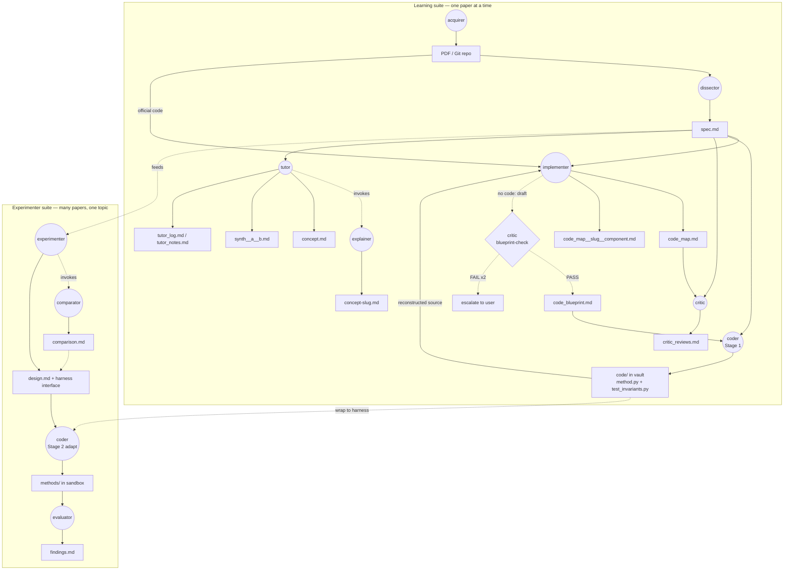
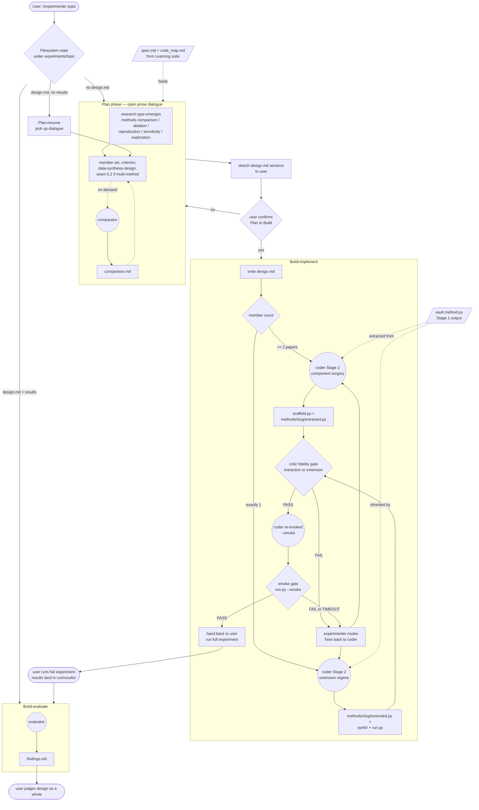
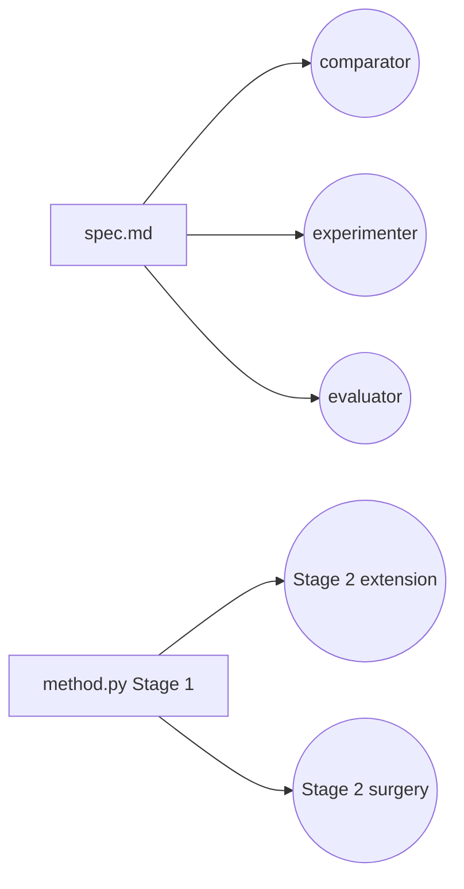

# PaperLab architecture

**Audience:** humans (maintainers, students) orienting to how PaperLab fits together. **Subagents and skills must not treat this file as authoritative** — contracts, paths, YAML rules, and the verifier live in **[`AGENTS.md`](./AGENTS.md)** and **`.cursor/skills/*/SKILL.md`**.

How the multiagent system is put together: what the pieces are, how they exchange state, and what invariants keep the orchestration trustworthy. For **what shipped next** and known gaps, see [`ROADMAP.md`](./ROADMAP.md).

## Goals and non-goals

**Goals**

- Help a reader *internalize* the math and design choices in ML methods papers — not skim them.
- Make implementation choices explicit: map claims to code when upstream exists, or to a blueprint + audited reconstruction when it does not.
- Support multi-paper empirical comparison on a shared problem class without losing the paper-level firewall.
- Keep the human in the loop on destructive actions (overwrites, escalation after failed gates, judging experiment designs).

**Non-goals**

- Replace reading the paper or doing the thinking for the student.
- Run large-scale training or production compute (agents orchestrate design and code; the user runs heavy jobs).
- Guarantee mathematical correctness or citation *appropriateness* (verifiers catch structural / resolver failures, not semantics — see Verifier system).

## Design principles

**Vault as shared memory.** Subagents do not message each other in-process. They coordinate by reading and writing markdown (and a small amount of runnable code under `code/` in the vault) plus repo-side PDFs, clones, and sandbox trees. If a fact needs to move from agent A to agent B, it must land in an artifact on disk.

**Single-writer firewall.** Every durable artifact has exactly one writer role. Downstream agents read but do not silently rewrite upstream artifacts. This is what makes critic gates legible: the critic audits files authored by someone else.

**Generator / discriminator separation.** The `critic` is deliberately not the author of the artifacts it audits. Blueprint-check, hop-2-vs-spec, extraction-fidelity, and extension-fidelity are four concrete instantiations of the same pattern: an independent pass over a frozen payload before the next hop commits more structure.

**Two-hop fidelity bridge (no-official-code path).** Math in the PDF flows to `code_blueprint.md` (hop 1, critic blueprint-check), then to `method.py` + invariant tests (hop 2, runtime asserts), then to `code_map.md` + `code_review.md` (walkthrough + fidelity audit authored and read under the same firewall rules as official-code papers).

**Two suites, two homes for knowledge.** Paper-bound knowledge lives with the paper under `<vault>/<slug>/`. Experiment-bound design and write-ups live under `<vault>/experiments/<topic>/`, while runnable glue and results live under `sandbox/experiments/<topic>/`. The bridge between suites is intentional and narrow (chiefly `spec.md` and Stage-1 `method.py`).

## File layout contract

Two locations, clean split: **code and source material in the repo, agent-generated notes in the vault**.

### Repo (`paperlab-cursor/`)

```
paperlab-cursor/
├── .cursor/                       agents, skills, rules
├── papers/
│   └── <slug>/
│       ├── <slug>.pdf             paper PDF (large; git-ignored)
│       ├── supplementals/         appendices, supplementary PDFs
│       └── upstream/
│           └── <slug>/            cloned official git repo
├── sandbox/
│   └── <slug>/                    toy experiments
├── sandbox/experiments/<topic>/   experimenter suite code (tracked); data/ git-ignored
├── paperlab.config.yaml           per-machine, git-ignored
├── paperlab.config.example.yaml   committed template
├── ARCHITECTURE.md                this document
├── AGENTS.md
├── ROADMAP.md
└── README.md
```

### Vault (Obsidian)

Per-paper notes live flat under one folder per paper. Multi-paper experiment notes live under `experiments/<topic>/`.

```
<vault_paperlab_path>/
├── <slug>/
│   ├── paper-info.md
│   ├── spec.md
│   ├── code_map.md
│   ├── critic_reviews.md          when code_map source is official
│   ├── code_review.md             when code_map source is reconstructed
│   ├── tutor_log.md
│   ├── tutor_notes.md
│   ├── <concept>.md
│   ├── <concept>-<slug>.md
│   ├── synth__<a>__<b>.md
│   ├── synth__<a>__<b>-<slug>.md
│   ├── code/                      Stage-1 method code (exception; see below)
│   │   ├── method.py
│   │   ├── test_invariants.py
│   │   └── README.md              optional bare stub (not a walkthrough)
│   └── notes.md                   user-owned; agents do not edit user prose
└── experiments/
    └── <topic>/
        ├── comparison.md
        ├── design.md
        └── findings.md
```

**Exception to the code/notes split (2026-06-04):** the `coder`'s Stage-1 output is the one place runnable `.py` lives in the **vault** rather than the repo. Rationale: per-paper method code is reusable, user-reviewable, and travels with the notes it is derived from. It lives in `vault_code_dir(slug)` (`code/`); the post-hoc verifier hook targets `.md` only, so this tree is guarded by invariant tests instead. Everything else still obeys *code in repo, generated markdown in vault*.

The algorithm-to-code **walkthrough** for reconstructed code is **not** in `code/` — it is the implementer's `code_map.md` (reconstructed source; same schema as official), audited by the critic against `spec.md`. See [`log/2026-06-04-codemap-from-coder-critic-audit.md`](./log/2026-06-04-codemap-from-coder-critic-audit.md).

### Cross-references

- `paper-info.md` uses **absolute** links to the repo-side PDF and upstream clone, built from `repo_root` in `paperlab.config.yaml`. Paths differ per machine.
- Path resolution for agents is centralized in `tools/paths.py` (see [`README.md`](./README.md) Quick start and `AGENTS.md`).

### Unified file convention

- One schema; no agent-only or user-only file variants.
- On regeneration of an existing vault file, agents must ask: **replace**, **append**, or **abort** (see `.cursor/rules/paperlab-regenerate-prompt.mdc`).
- All per-paper folders follow the same flat layout; no per-paper config files.

## The two suites

### End-to-end diagram



### Learning suite (one paper at a time)

#### Sequence view (simplified)

Logical order of handoffs (vault collapsed to one lifeline). Blueprint path, Stage 1 `code/`, and `explainer` are omitted here; see prose below and [`AGENTS.md`](./AGENTS.md).

```mermaid
sequenceDiagram
    actor U as User
    participant A as acquirer
    participant D as dissector
    participant I as implementer
    participant C as critic
    participant T as tutor
    participant V as vault

    U->>A: acquire paper
    A->>V: paper-info.md
    A->>D: often auto-chained
    D->>V: spec.md

    U->>I: map paper to implementation
    I->>V: code_map.md and related artifacts

    U->>C: audit claims and alignment
    C->>V: critic_reviews.md or code_review.md

    U->>T: /tutor
    T->>V: read spec, code_map, audits
    T->>V: append tutor_log.md; concept files on request
```

`acquirer`, `dissector`, `implementer`, `critic`, `tutor`, plus the backend `explainer`. The `acquirer` sets up the paper; the `dissector` writes `spec.md`. The `implementer` maps concepts to code (official upstream or reconstructed `method.py`). The `critic` audits. The `tutor` is the user-facing concept interface (`/tutor <slug>`) and invokes the `explainer` when paper-bound intermediates are missing.

When a paper ships **no official code**, the `implementer`'s opt-in **blueprint mode** writes `code_blueprint.md` from the math. The draft is gated **pre-emission** by the `critic` blueprint-check (independent re-derivation). On PASS the blueprint is written; on repeated FAIL the implementer escalates to the user.

The `coder`'s **Stage 1** (`/coder code <slug>`) turns a blueprint (or a mapped upstream reimplementation brief) into `method.py` + `test_invariants.py` under `<vault>/<slug>/code/`, with blueprint invariants executed as runtime asserts on synthetic input (**hop-2-vs-blueprint**).

The walkthrough is always the implementer's job: for reconstructed code it maps `method.py` against `spec.md` into `code_map.md`, and the `critic` writes the fidelity audit to `code_review.md` (vs `critic_reviews.md` for official). Neither hop is performed by the agent that authored the payload under review.

### Experimenter suite (many papers, one topic)



`experimenter`, `comparator`, `coder`, `evaluator`. The `experimenter` runs as a skill in the main chat (`/experimenter <topic>`): Plan phase (open dialogue) and Build phase (write `design.md`, invoke `coder` Stage 2, route critic fidelity gates and the smoke gate, then Build-evaluate when `run/results/` exists). The `comparator` supplies conceptual trade-offs into `comparison.md` when needed. The `evaluator` turns JSON results into `findings.md`.

### How the suites connect

Stage 1 (Learning) writes the paper-bound `Method` once under `<vault>/<slug>/code/`. Stage 2 (Experimenter) adapts it to the topic harness under `sandbox/experiments/<topic>/`. That split is deliberate: paper-bound knowledge stays with the paper; experiment glue stays with the experiment.

**Status.** Shipped surface area and remaining follow-ups (for example A2 production-flow smoke) are tracked in [`ROADMAP.md`](./ROADMAP.md) (Agents table and Planned units).

## Memory sharing design

Agents coordinate through **files**, not shared RAM. The vault is the primary interchange; the repo holds PDFs, upstream clones, per-topic sandbox code, and the citation resolver cache.

### Single-writer matrix (canonical)

| Artifact | Writer |
| --- | --- |
| `paper-info.md` | `acquirer` |
| `spec.md` | `dissector` |
| `code_blueprint.md` | `implementer` (blueprint mode) |
| `code/method.py`, `code/test_invariants.py` | `coder` Stage 1 |
| `code_map.md` (+ optional deep-dive files) | `implementer` |
| `critic_reviews.md` / `code_review.md` | `critic` |
| `<concept>-<slug>.md`, `synth__a__b-<slug>.md` | `explainer` |
| `<concept>.md`, `synth__a__b.md`, `tutor_notes.md`, `tutor_log.md` | `tutor` |
| `comparison.md` | `comparator` |
| `design.md` | `experimenter` (main chat agent running the skill) |
| `findings.md` | `evaluator` |
| `sandbox/experiments/<topic>/...` (scaffold, methods, run) | `coder` Stage 2 (with user-run for full jobs) |
| `papers/<slug>/.cache/citations/*` | `citation-verifier` (resolver cache) |

**Readers.** Many agents read `spec.md` (implementer, critic, tutor, explainer, comparator, experimenter, evaluator). `code_map.md` feeds critic, tutor, comparator, and Stage 2 coding. `design.md` feeds `coder` Stage 2 and the `evaluator`. Run JSON under `sandbox/experiments/<topic>/run/results/` feeds the `evaluator`.

### Cross-suite bridge (narrow on purpose)



**Tutor self-memory.** `tutor_log.md` is append-only per turn; the `tutor` reads it back on resume. No other agent writes it.

**What is not shared.** Another agent's prompt, scratchpad, or chat history is not visible. If it is not in an artifact above, it does not exist for the rest of the system.

## Verifier system

**Normative copy for agents:** [`AGENTS.md`](./AGENTS.md) § Verifier system (same tables and rules). What follows is a reader digest for humans who prefer narrative context here.

PaperLab runs `latex-verifier` and `citation-verifier` against generated markdown to catch **structural** math breakage and **resolver-level** citation mistakes. Both wrap pure-Python tools and emit structured JSON; callers translate JSON into **PASS** / **FAIL** behavior.

### Two trigger paths

1. **Inline gate (primary).** Runs before emission / before declaring output complete. Order: LaTeX first, citations second, **separate retry budgets** (max 2 each) where the skill requires it. Applies to Tutor, Explainer, Dissector, Comparator, Experimenter (`design.md`), Evaluator (`findings.md`). Failed citations fail only on `mismatched`; `unresolved` is disclosed but does not block, because resolvers can transiently fail.
2. **Post-hoc hook (backstop).** On `.md` writes under a per-paper `<slug>/` vault folder (except `tutor` / `explainer-intermediate` writers per hook rules), `.cursor/hooks.json` runs `tools/hooks/verify_on_vault_write.py`. Appends results to `verifier_log.md` and returns `additional_context` to the caller. **Fails open** (never blocks the write on verifier crash).

### Asymmetry on the experiments tree

The hook skips `experiments/<topic>/`, so those files are inline-gated only:

| Artifact | Writer | LaTeX gate | Citation gate |
| --- | --- | --- | --- |
| `comparison.md` | `comparator` | inline | inline |
| `design.md` | `experimenter` | inline | none |
| `findings.md` | `evaluator` | inline | none |

Rationale and revisit trigger are recorded in [`log/2026-06-18-experimenter-evaluator-latex-gate.md`](./log/2026-06-18-experimenter-evaluator-latex-gate.md) and [`log/2026-06-17-evaluator-experimenter-gaps.md`](./log/2026-06-17-evaluator-experimenter-gaps.md).

### What flips a verdict

| Verifier | PASS | FAIL |
| --- | --- | --- |
| `latex-verifier` | No `error`-severity findings | One or more `error` findings |
| `citation-verifier` | No `mismatched` rows | One or more `mismatched` rows |

`warning` (LaTeX) and `unresolved` / `skipped` (citations) never flip PASS, but `unresolved` rows require a disclosure block on PASS.

### Scope: what the verifiers do not catch

Signature-based checks only — not semantic truth. Out of scope by design: book citations without structured resolvers, bare author-year prose, private documents, **mathematical correctness of equations**, and **whether a citation supports the claim**. The Tutor remains responsible for honesty on claim-citation fit (`ml-tutor` R3).

### Per-paper citation cache

Resolver output is cached at `papers/<slug>/.cache/citations/` keyed by `(kind, id)`. Session-end clearing is on the roadmap (see [`ROADMAP.md`](./ROADMAP.md) Known limitations / roadmap notes).

### Tool layer

- `tools/verify_latex.py` — lexer v1; KaTeX strict mode is planned separately.
- `tools/verify_citations.py` — detector + resolver chain (arXiv Atom, Crossref, firecrawl CLI fallback).

## YAML front-matter and graph index

Agent-generated vault markdown carries YAML front-matter so Obsidian and future tooling can group artifacts. **Authoritative key order, semantics, multi-paper headers, and slug quoting:** [`AGENTS.md`](./AGENTS.md) § YAML front-matter (this section is a short human digest only).

`status`, `sources`, and `concepts` are **graph-index groundwork**: today they mainly power Obsidian links; tomorrow `tools/reindex.py` ingests them into `graph.json` under `vault_index_dir()`.

**`tools.reindex` v1 (shipped 2026-06-02).** Deterministic walk of the vault: parse front-matter, parse body `[[wiki-links]]`, emit nodes (papers, topics, artifacts, concepts) and edges (`has_artifact`, `includes_paper`, `has_status`, `derived_from`, `mentions`). Drift warnings go to stderr (missing `agent`/`status`, unknown concept names, broken `sources` links). CLI: `python -m tools.reindex` and `--check`. See [`ROADMAP.md`](./ROADMAP.md) § Planned units → `tools.reindex` for v2 directions (staleness, agents-consult-graph, lifecycle queries, rollup).

## Decision framework: agent vs skill vs rule vs hook vs MCP

**Normative for agents:** [`AGENTS.md`](./AGENTS.md) § Decision framework (same bullets). What follows duplicates it for human readers who stay in this file.

Recorded so future-us does not re-derive it.

1. Needs access outside the repo (API, DB, external file)? → **MCP**.
2. Should run automatically on events, deterministically? → **Hook**.
3. Is a *role* with judgment, multi-step? → **Subagent** (typically uses skills + MCPs).
4. Is *reference material* loaded on demand for specific tasks? → **Skill**.
5. Is an always-on (or glob-scoped) *constraint or convention*? → **Rule**.

Litmus tests:

- Skill vs Rule: needed *sometimes* (skill) or *always when touching matching files* (rule)?
- Skill vs Subagent: *how to do it* (skill) vs *thing that does it* (subagent)?
- Subagent vs Hook: needs *judgment* (subagent) vs *deterministic reaction* (hook)?
- MCP vs nothing: a shell + `Read` will not cut it? → MCP.

Anti-pattern: building a subagent for a deterministic transformation. Use a hook or script.

## Pointers

- [`AGENTS.md`](./AGENTS.md) — **authoritative** subagent contracts, YAML, verifier system, paths, sandbox.
- [`README.md`](./README.md) — project front door and quick start.
- [`ROADMAP.md`](./ROADMAP.md) — shipped vs planned, known limitations, schema candidates.
- [`log/`](./log/) — dated decision narratives.
- [`tools/paths.py`](./tools/paths.py) — canonical path resolution (`python -m tools.paths …`).
