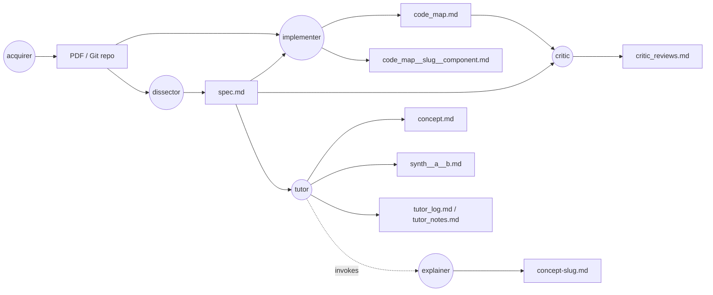

# paperlab

`paperlab` is a multiagent system to help students to understand papers in machine learning and deep learning.

## Work flow

The user-facing concept interface is the `tutor` (`/tutor <slug>`); it
invokes the `explainer` in the background. The **experimenter suite**
(multi-paper empirical comparison) runs alongside this per-paper flow:
the `comparator` (shipped) compares methods across papers along an axis
and writes `comparison.md` to `<vault>/experiments/<topic>/`; the
`experimenter`, `coder`, and `evaluator` are designed (see `ROADMAP.md`).
