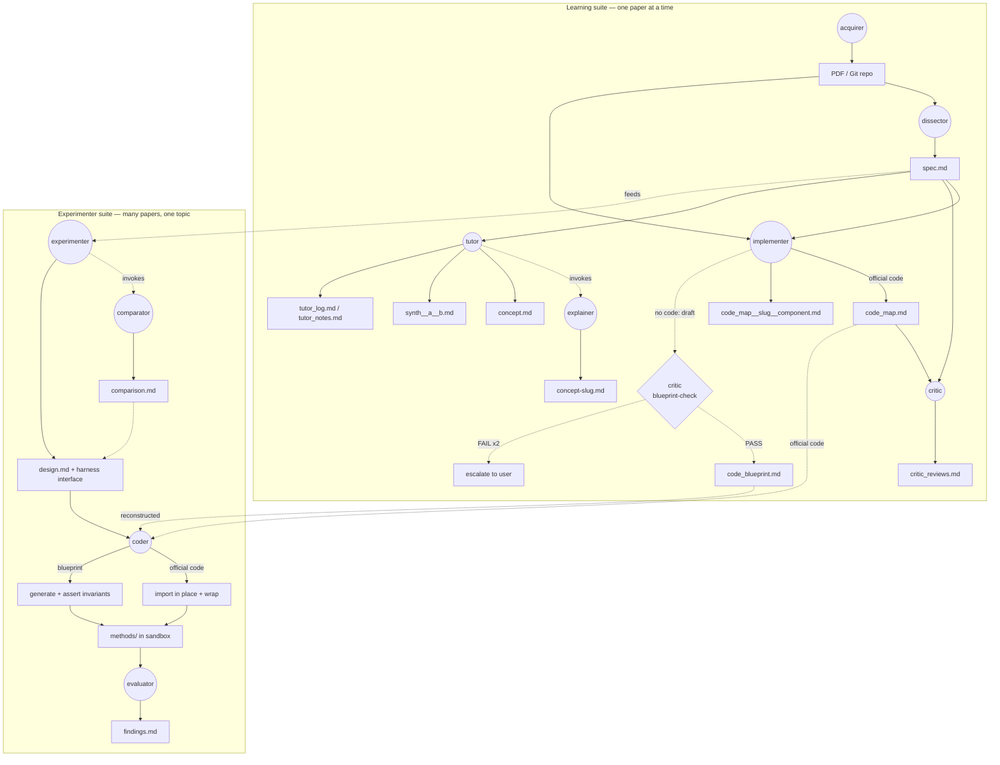

# paperlab

`paperlab` is a multiagent system to help students to understand papers in machine learning and deep learning.

## Work flow

### Learning suite (one paper at a time)

`acquirer`, `dissector`, `implementer`, `critic`, `tutor`, plus the
backend `explainer`. The `acquirer` sets up the paper and the `dissector`
extracts `spec.md`; from there the `implementer` maps code, the `critic`
audits, and the `tutor` (the user-facing concept interface, `/tutor
<slug>`) explains — invoking the `explainer` in the background.

When a paper ships **no official code**, the `implementer`'s explicit,
opt-in **blueprint mode** reconstructs a framework-agnostic
implementation contract (`code_blueprint.md`) from the math. The draft is
gated **pre-emission** by the `critic`'s blueprint-check — the critic
re-derives the paper's math *independently* (the firewall) — and the file
is written only on PASS, else the implementer escalates after two retries.

### Experimenter suite (many papers, one topic)

`experimenter`, `comparator`, `coder`, `evaluator`. The `experimenter`
orchestrates an interactive design session (writing `design.md`,
including the **harness interface** every method conforms to), invoking
the `comparator` for conceptual method trade-offs (`comparison.md`). The
`coder` then fills each method behind the harness — **importing official
code** where it exists, or **generating from a `code_blueprint.md`** and
asserting its invariants at runtime — and the `evaluator` interprets the
runs into `findings.md`.

**The two suites connect at the artifacts:** a paper's `spec.md`,
`code_map.md`, and `code_blueprint.md` (produced by the Learning suite)
are the inputs the Experimenter suite's `coder` builds methods from. This
is the two-hop fidelity bridge — hop-1 (math → blueprint) guarded by the
critic, hop-2 (blueprint → code) guarded by invariants-as-assertions.

**Status:** the Learning suite is shipped. In the Experimenter suite the
`comparator` is shipped and the `experimenter` design-phase shell is
shipped; the `coder` and `evaluator` are designed (see `ROADMAP.md`).
