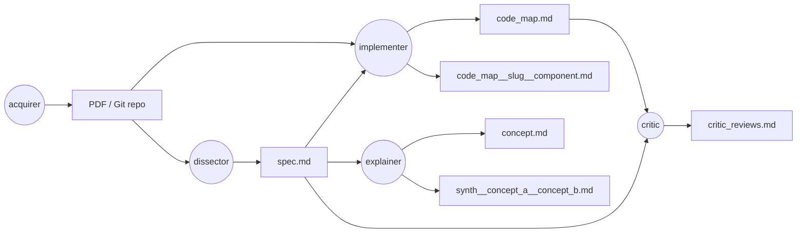

# paperlab

`paperlab` is a multiagent system to help students to understand papers in machine learning and deep learning.

## Work flow

```mermaid
flowchart LR
    Acquirer((acquirer)) --> Sources[PDF / Git repo]
    Sources --> Dissector((dissector))
    Dissector --> Spec[spec.md]

    Spec --> Implementer((implementer))
    Sources --> Implementer
    Implementer --> CodeMap[code_map.md]
    Implementer --> DeepDive[code_map__slug__component.md]

    Spec --> Explainer((explainer))
    Explainer --> Concept[concept.md]
    Explainer --> Synth[synth__concept_a__concept_b.md]

    Spec --> Critic((critic))
    CodeMap --> Critic((critic))
    Critic --> Review[critic_reviews.md]
```
