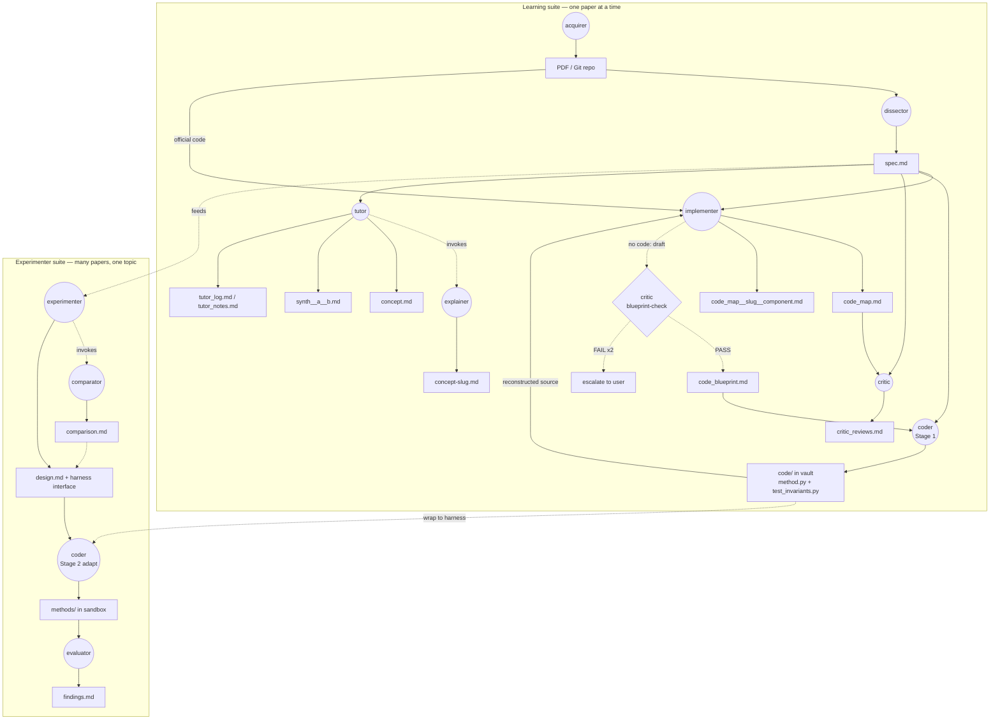

# paperlab

`paperlab` is a multiagent system to help students to understand papers in machine learning and deep learning.

## Work flow

### Learning suite (one paper at a time)

`acquirer`, `dissector`, `implementer`, `critic`, `tutor`, plus the
backend `explainer`. The `acquirer` sets up the paper and the `dissector`
extracts `spec.md`; from there the `implementer` maps code, the `critic`
audits, and the `tutor` (the user-facing concept interface, `/tutor
<slug>`) explains — invoking the `explainer` in the background.

When a paper ships **no official code**, the `implementer`'s explicit,
opt-in **blueprint mode** reconstructs a framework-agnostic
implementation contract (`code_blueprint.md`) from the math. The draft is
gated **pre-emission** by the `critic`'s blueprint-check — the critic
re-derives the paper's math *independently* (the firewall) — and the file
is written only on PASS, else the implementer escalates after two retries.

The `coder`'s **Stage 1** (`/coder code <slug>`) then turns that
blueprint into reusable, runnable method code under `<vault>/<slug>/code/`
— `method.py` (a hybrid `Method` interface: paper-natural guts behind one
documented entry point) plus `test_invariants.py`, which emits the
blueprint's invariants as runtime assertions and runs them on synthetic
input (the **hop-2-vs-blueprint guard**). The method is coded once per
paper here and reused by every experiment that needs it.

The walkthrough then comes from the **same agent that documents official
code**: the `implementer` maps `method.py` against `spec.md` into a
`code_map.md` (its `reconstructed` source — identical format to the
official-code map), and the `critic` audits that map against the spec (a
**fidelity** audit: did the reconstruction drift from the paper?). So a
no-code paper ends up with the same `code_map.md` + `critic_reviews.md`
as a code-having one. Two firewalled checks bracket the reconstruction:
the critic guards the blueprint pre-emission (hop 1), and the critic
audits the resulting `code_map` against the spec (hop-2-vs-spec) — neither
performed by the agent that authored the artifact under review.

### Experimenter suite (many papers, one topic)

`experimenter`, `comparator`, `coder`, `evaluator`. The `experimenter`
orchestrates an interactive design session (writing `design.md`,
including the **harness interface** every method conforms to), invoking
the `comparator` for conceptual method trade-offs (`comparison.md`). The
`coder`'s **Stage 2 adapt-mode** then wraps each paper's Stage-1 method
(the reusable `Method` already in `<vault>/<slug>/code/`) to that harness
under `sandbox/experiments/<topic>/methods/`, and the `evaluator`
interprets the runs into `findings.md`.

**The two suites connect at the method code:** Stage 1 (Learning suite)
writes the paper-bound method once in the vault; Stage 2 (Experimenter
suite) wraps it to a topic harness. This mirrors PaperLab's firewall
philosophy — paper-bound knowledge lives with the paper, experiment glue
lives with the experiment — and rides the two-hop fidelity bridge: hop-1
(math → blueprint) guarded by the critic, hop-2 (blueprint → code)
guarded by invariants-as-assertions in Stage 1.

**Status:** the Learning suite is shipped, now including the `coder`'s
Stage 1 (`/coder code <slug>`, shipped 2026-06-04). In the Experimenter
suite the `comparator` and the `experimenter` design-phase shell are
shipped; the `coder`'s Stage 2 adapt-mode and the `evaluator` are
designed (see `ROADMAP.md`).
