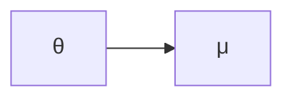

Clean example with inline $x = 1$ and display:

$$
\int_0^1 f(x)\,dx = F(1) - F(0)
$$

An align block:

$$
\begin{align}
  a &= b \\
  c &= d
\end{align}
$$

Mermaid with Unicode is fine (allowed exception):

A KL with `\left`/`\right`:

$$
D_{KL}(P \| Q) = \sum_x P(x) \log\left(\frac{P(x)}{Q(x)}\right)
$$
